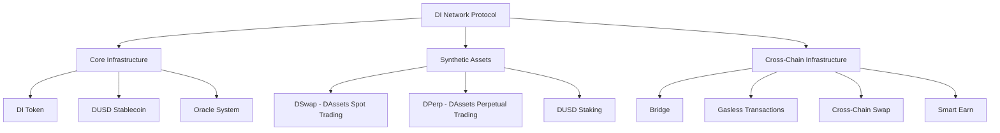

# DI Network Documentation

Welcome to the comprehensive documentation for DI Network, a next-generation cross-chain protocol that enables seamless multi-chain interoperability and synthetic asset trading.

## What is DI Network?

DI Network is a decentralized protocol that provides:

- **Cross-Chain Infrastructure**: Bridge, gasless transactions, cross-chain swaps, and earning opportunities
- **Synthetic Asset Trading**: Trade stocks, commodities, forex, and crypto without custody
- **Perpetual Futures**: CEX-style order book trading with up to 100x leverage
- **DUSD Stablecoin**: Algorithmic stablecoin backed by over-collateralization

## Key Features

### 🌉 Cross-Chain Infrastructure
Comprehensive multi-chain ecosystem including bridge, gasless transactions, cross-chain swaps, and earning opportunities.

### 🔄 Synthetic Assets(DAssets) and ⚡ Perpetual Trading (DPerp)
Trade synthetic versions of real-world assets with oracle-based pricing and zero slippage. Professional perpetual futures trading with CEX-style order books and trader-to-trader matching.

### 💰 DUSD Stablecoin
Algorithmic stablecoin with dynamic backing and advanced risk management.

## Getting Started


[quick-start.md](introduction/quick-start.md)



[protocol-overview.md](introduction/protocol-overview.md)


## Core Components

<table data-view="cards">
<thead>
<tr>
<th></th>
<th></th>
<th data-hidden data-card-target data-type="content-ref"></th>
</tr>
</thead>
<tbody>
<tr>
<td><strong>DAssets - Synthetic Trading</strong></td>
<td>Trade synthetic assets with virtual positions and dynamic risk management</td>
<td><a href="dassets/">dassets</a></td>
</tr>
<tr>
<td><strong>DPerp - Perpetual Futures</strong></td>
<td>CEX-style order book trading with up to 100x leverage</td>
<td><a href="dassets/dperp/">dperp</a></td>
</tr>
<tr>
<td><strong>DUSD Stablecoin</strong></td>
<td>Algorithmic stablecoin with collateral backing and interest rates</td>
<td><a href="core-infrastructure/dusd/">dusd</a></td>
</tr>
<tr>
<td><strong>Cross-Chain Infrastructure</strong></td>
<td>Bridge, gasless transactions, cross-chain swaps, and earning opportunities</td>
<td><a href="cross-chain/">cross-chain</a></td>
</tr>
</tbody>
</table>

## Architecture Overview

## Quick Navigation

### For Traders
- [Getting Started Guide](user-guides/getting-started.md)
- [Spot Trading Tutorial](user-guides/trading/spot.md)
- [Perpetual Trading Guide](user-guides/trading/perpetuals.md)
- [Risk Management](user-guides/trading/risk.md)

### For Developers
- [Development Setup](developers/setup.md)
- [SDK Reference](developers/sdk/)
- [Smart Contracts](developers/contracts/)
- [API Documentation](developers/api/)

### For Stakers
- [DUSD Staking Guide](dassets/dusd-staking.md)
- [Governance Participation](user-guides/governance/)
- [Rewards System](user-guides/staking/rewards.md)

## Community & Support

- **Discord**: [Join our community](https://discord.gg/dinetwork)
- **Twitter**: [@DINetwork](https://twitter.com/dinetwork)
- **GitHub**: [DI Network](https://github.com/di-network)
- **Documentation**: [GitBook](https://docs.dinetwork.org)

## Security & Audits

DI Network prioritizes security through:
- Multiple security audits by leading firms
- Formal verification of critical functions
- Comprehensive testing and bug bounty programs
- Gradual rollout with conservative parameters


[security](security/)


---

**Ready to get started?** Check out our [Quick Start Guide](introduction/quick-start.md) or explore the [Protocol Overview](introduction/protocol-overview.md) to learn more about DI Network's innovative approach to synthetic asset trading.