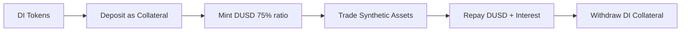
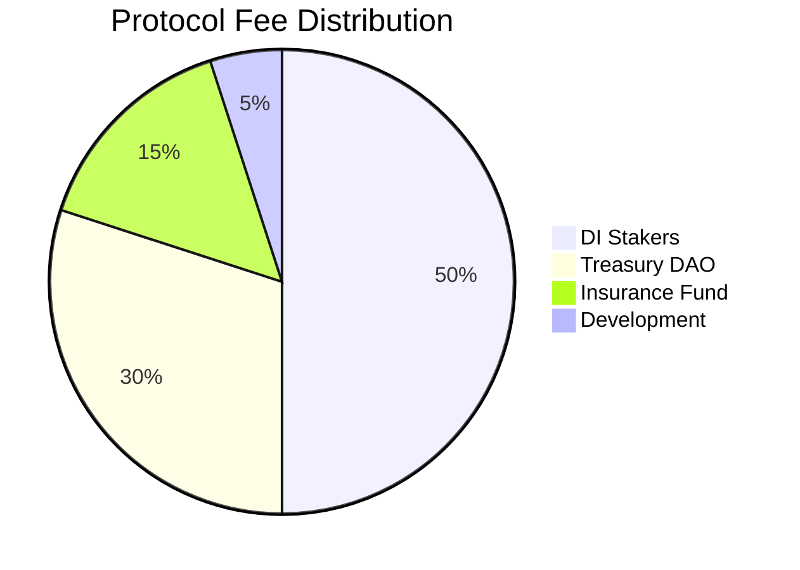

# DI Token

The DI Token is the native governance and utility token of the DI Network ecosystem. It serves as the primary collateral asset, governance token, and value accrual mechanism across all protocol modules.

## Token Specifications

| Property | Value |
| --- | --- |
| **Name** | DI Token |
| **Symbol** | DI |
| **Type** | ERC20Votes (Governance Token) |
| **Decimals** | 18 |
| **Total Supply** | 1,000,000,000 (1 Billion) |
| **Contract Standard** | ERC20 + ERC20Votes + ERC20Permit |

## Core Utilities

### 1. Primary Collateral Asset

DI tokens serve as the main collateral for minting DUSD stablecoin:

- **Collateral Factor**: 75% - mint up to 0.75 DUSD per $1 of DI
- **Interest Rate**: 5% APR on borrowed DUSD
- **Liquidation Threshold**: 80% - positions liquidated if ratio falls below
- **Liquidation Penalty**: 5% bonus to liquidators



### 2. Governance Rights

DI token holders control the protocol through decentralized governance:

**Voting Power**:
- 1 DI token = 1 vote (after delegation)
- Quadratic voting for certain proposals
- Historical voting power tracked via ERC20Votes

**Governance Scope**:
- Protocol parameters (interest rates, collateral factors, leverage limits)
- Risk management (new collateral assets, synthetic assets)
- Treasury management (protocol treasury allocation)
- Emergency actions (pause mechanisms, upgrades)

**Governance Process**:
1. **Proposal Creation**: Requires 1% of total supply (10M DI)
2. **Voting Period**: 7 days for community voting
3. **Quorum**: 4% of total supply (40M DI) must participate
4. **Execution**: 48-hour timelock before implementation

### 3. Staking Rewards

Stake DI tokens to earn rewards and boost governance power:

| Lock Period | APY Multiplier | Base APY | Effective APY |
| --- | --- | --- | --- |
| No Lock | 1.0x | 8% | 8% |
| 3 Months | 1.2x | 8% | 9.6% |
| 6 Months | 1.5x | 8% | 12% |
| 12 Months | 2.0x | 8% | 16% |
| 24 Months | 2.5x | 8% | 20% |

**Reward Sources**:
- 50% of all protocol fees
- Liquidation bonuses and penalties
- Cross-chain bridge transaction fees
- New token emissions (decreasing over time)

### 4. Fee Distribution

DI token stakers receive a share of protocol revenue:



**Fee Sources**:
- Trading fees from synthetic asset trades (0.1-0.3%)
- Interest payments on borrowed DUSD (5% APR)
- Perpetual trading fees and funding rates
- Cross-chain bridge transaction fees
- Liquidation penalties (5% of collateral)

## Token Distribution

### Allocation Breakdown

| Category | Amount | Percentage | Vesting Schedule | TGE Unlock |
| --- | --- | --- | --- | --- |
| **Team** | 150M | 15% | 48mo linear, 12mo cliff | 0% |
| **Advisors** | 50M | 5% | 24mo linear, 6mo cliff | 0% |
| **Public Sale** | 100M | 10% | 6mo linear | 30% |
| **DI Liquidity** | 150M | 15% | No vesting | 100% |
| **DUSD Liquidity** | 100M | 10% | No vesting | 100% |
| **Treasury** | 150M | 15% | 60mo linear | 0% |
| **Ecosystem** | 120M | 12% | 36mo linear | 15% |
| **Private Sale** | 120M | 12% | 18mo linear, 6mo cliff | 0% |
| **Marketing** | 50M | 5% | 24mo linear | 20% |
| **KOL** | 30M | 3% | 12mo linear, 3mo cliff | 0% |
| **Development** | 30M | 3% | 36mo linear | 10% |

### Circulating Supply Schedule

| Month | Circulating Supply | % of Total | Key Events |
| --- | --- | --- | --- |
| **TGE** | 311M | 31.1% | Liquidity + 30% public sale |
| **6** | 424M | 42.4% | Public sale complete |
| **12** | 544M | 54.4% | Team cliff ends |
| **24** | 704M | 70.4% | Major vestings complete |
| **48** | 1,000M | 100.0% | All tokens released |

### Vesting Rationale

**Why Public Sale Vesting Matters**:

DI Token is critical infrastructure, not just a utility token:
- Primary collateral for DUSD stability
- Price oracle input for synthetic assets
- Cross-chain liquidity anchor
- Risk buffer for perpetual trading

Without proper vesting:
1. Large sell pressure at TGE → DI price drops
2. DUSD collateral ratio weakens → stablecoin instability
3. Synthetic asset pricing becomes volatile
4. Perpetual trading margin requirements fluctuate
5. Cross-chain bridge liquidity suffers

## Token Economics

### Value Accrual Mechanisms

1. **Collateral Demand**: DI needed for DUSD minting drives buying pressure
2. **Staking Rewards**: High APY creates token lock-up and demand
3. **Governance Premium**: Voting rights add intrinsic value
4. **Fee Distribution**: Revenue sharing provides cash flow value
5. **Buyback Mechanism**: Protocol uses revenue for token buybacks

### Supply Dynamics

- **Fixed Supply**: No additional minting after initial distribution
- **Burn Mechanism**: Potential token burns from buybacks
- **Vesting Release**: Gradual supply increase over 48 months
- **Staking Lock**: Significant portion locked reducing circulating supply

### Demand Drivers

- **Protocol Growth**: More usage = more fees = higher staking rewards
- **Cross-Chain Expansion**: New chains increase utility and demand
- **Product Launches**: New features (options, RWAs) drive adoption
- **Institutional Adoption**: Large users need governance participation

## How to Acquire DI Tokens

### Primary Markets

1. **Token Sales**: Participate in public or private sales
2. **Ecosystem Rewards**: Earn through protocol participation
3. **Staking Rewards**: Stake existing DI to earn more
4. **Liquidity Mining**: Provide liquidity to earn DI rewards

### Secondary Markets

1. **Decentralized Exchanges**:
   - Uniswap V3 (Ethereum): DI-ETH pool
   - PancakeSwap (BSC): DI-USDT pool
   - QuickSwap (Polygon): DI-MATIC pool

2. **Centralized Exchanges**:
   - Binance: DI-USDT trading pair
   - Coinbase: DI-USD trading pair
   - OKX: DI-USDT trading pair

## Using DI Tokens

### Staking for Rewards

```javascript
// Stake DI tokens for 6 months
await diToken.approve(stakingContract.address, amount);
await stakingContract.stake(amount, 6 * 30 * 24 * 3600); // 6 months in seconds

// Claim rewards
await stakingContract.claimRewards();

// Unstake after lock period
await stakingContract.unstake();
```

### Governance Participation

```javascript
// Delegate voting power (to self or others)
await diToken.delegate(delegateAddress);

// Check voting power
const votes = await diToken.getVotes(userAddress);

// Vote on proposal
await governance.vote(proposalId, support); // true for yes, false for no
```

### Collateral for DUSD

```javascript
// Deposit DI as collateral
await diToken.approve(dusdProvider.address, collateralAmount);
await dusdProvider.depositCollateral(collateralAmount);

// Borrow DUSD (up to 75% of collateral value)
await dusdProvider.borrowDUSD(dusdAmount);

// Repay DUSD and withdraw collateral
await dusd.approve(dusdProvider.address, repayAmount);
await dusdProvider.repayDUSD(repayAmount);
await dusdProvider.withdrawCollateral(collateralAmount);
```

## Security Features

### Smart Contract Security

- **Multiple Audits**: Audited by Trail of Bits and ConsenSys Diligence
- **Bug Bounty**: $500K active bug bounty program
- **Formal Verification**: Critical functions formally verified
- **Emergency Controls**: Pause mechanisms for critical vulnerabilities

### Economic Security

- **Oracle Protection**: Dual oracle system prevents price manipulation
- **Liquidation Engine**: Automated liquidations protect protocol solvency
- **Insurance Fund**: Protocol reserves for extreme market events
- **Dynamic Parameters**: Risk parameters adjust based on market conditions

### Governance Security

- **Timelock**: 48-hour delay on critical parameter changes
- **Multi-sig**: Emergency actions require 5-of-9 multi-signature
- **Proposal Validation**: Technical review before community voting
- **Execution Limits**: Maximum parameter change limits per proposal

## Monitoring & Analytics

### Key Metrics to Track

- **Price**: Current DI token price across exchanges
- **Market Cap**: Price × Circulating Supply
- **Total Staked**: Amount of DI locked in staking
- **Governance Participation**: Active voters and proposal turnout
- **Collateral Usage**: DI used as DUSD collateral
- **Fee Generation**: Protocol revenue and fee distribution

### Useful Tools

- **Token Tracker**: [Etherscan](https://etherscan.io/token/0x...) for on-chain data
- **Price Charts**: [CoinGecko](https://coingecko.com/en/coins/di-token) and [CoinMarketCap](https://coinmarketcap.com/currencies/di-token/)
- **Analytics Dashboard**: [analytics.dinetwork.xyz](https://analytics.dinetwork.xyz)
- **Governance Portal**: [gov.dinetwork.xyz](https://gov.dinetwork.xyz)

## Next Steps


[dusd-stablecoin.md](dusd-stablecoin.md)



[getting-started.md](../user-guides/getting-started.md)
