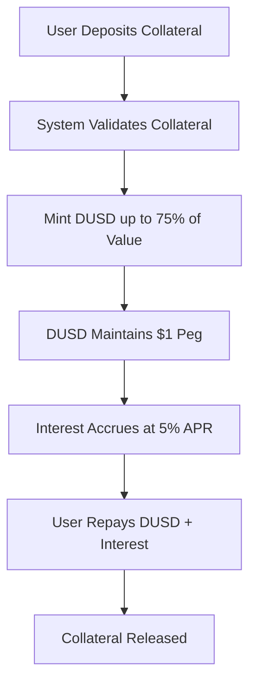
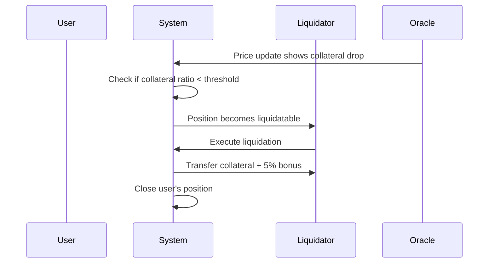
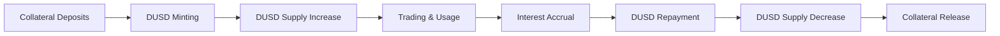

# DUSD Stablecoin

DUSD is DI Network's over-collateralized algorithmic stablecoin, serving as the base currency for all protocol operations. It maintains its $1 peg through a robust collateralization system and serves as the foundation for synthetic asset trading and cross-chain operations.

## Overview

DUSD (DI USD) is not just another stablecoin - it's the lifeblood of the DI Network ecosystem:

- **Algorithmic Stability**: Maintains $1 peg through over-collateralization
- **Multi-Collateral**: Backed by DI, WBTC, WETH, USDT, and USDC
- **Cross-Chain Native**: Available on all supported networks
- **Interest-Bearing**: Borrowed DUSD accrues 5% APR interest

## Key Features

### 1. Over-Collateralized Stability

Unlike algorithmic stablecoins that rely on market mechanisms, DUSD uses over-collateralization:



**Collateral Factors**:
- **DI Token**: 75% (mint 0.75 DUSD per $1 of DI)
- **WBTC**: 70% (mint 0.70 DUSD per $1 of WBTC)
- **WETH**: 70% (mint 0.70 DUSD per $1 of WETH)
- **USDT**: 90% (mint 0.90 DUSD per $1 of USDT)
- **USDC**: 90% (mint 0.90 DUSD per $1 of USDC)

### 2. Multi-Collateral System

DUSD accepts multiple types of collateral to ensure stability and decentralization:

| Collateral | Factor | Liquidation Threshold | Risk Level |
| --- | --- | --- | --- |
| **DI Token** | 75% | 80% | Medium |
| **WBTC** | 70% | 75% | Low |
| **WETH** | 70% | 75% | Low |
| **USDT** | 90% | 95% | Very Low |
| **USDC** | 90% | 95% | Very Low |

### 3. Interest Rate Model

DUSD borrowing uses a simple fixed interest rate model:

- **Base Rate**: 5% APR on all borrowed DUSD
- **Compound Interest**: Interest compounds continuously
- **No Variable Rates**: Predictable borrowing costs
- **Early Repayment**: No penalties for early repayment

```solidity
// Interest calculation
interestAccrued = borrowedAmount * interestRate * timeElapsed / SECONDS_PER_YEAR
totalDebt = borrowedAmount + interestAccrued
```

## How DUSD Works

### Minting Process

1. **Deposit Collateral**: User deposits approved collateral tokens
2. **Collateral Valuation**: Oracle prices determine USD value
3. **Borrowing Power**: Calculate max DUSD based on collateral factor
4. **Mint DUSD**: User borrows desired amount (up to limit)
5. **Interest Tracking**: System tracks borrowed amount and accrual

### Repayment Process

1. **Interest Accrual**: System calculates accumulated interest
2. **Repayment**: User repays DUSD + interest
3. **Collateral Release**: Proportional collateral released
4. **Full Repayment**: All collateral released when debt = 0

### Liquidation Mechanism

Positions are liquidated when collateral value falls below the liquidation threshold:



**Liquidation Conditions**:
- Collateral ratio falls below liquidation threshold
- Remaining collateral < debt + fees + liquidation penalty
- Position becomes insolvent due to interest accrual

**Liquidation Process**:
- Liquidator repays user's debt
- Liquidator receives collateral + 5% bonus
- User's position is closed
- Excess collateral (if any) returned to user

## Use Cases

### 1. Synthetic Asset Trading

DUSD serves as the base currency for all synthetic asset operations:

```javascript
// Mint synthetic Bitcoin with DUSD
await dusd.approve(dswap.address, dusdAmount);
await dswap.mintSynthetic("xBTC", dusdAmount);

// Swap between synthetic assets
await dswap.swapSynthetic("xBTC", "xETH", synthAmount);

// Burn synthetic assets back to DUSD
await dswap.burnSynthetic("xETH", synthAmount);
```

### 2. Perpetual Trading

DUSD is used as collateral for leveraged perpetual positions:

```javascript
// Open leveraged position with DUSD
await dusd.approve(dperp.address, collateralAmount);
await dperp.increasePosition(
    "BTC",           // asset
    positionSize,    // size in USD
    true,           // isLong
    leverage        // leverage multiplier
);
```

### 3. Cross-Chain Gas Payments

DUSD enables gasless transactions across all supported chains:

```javascript
// Deposit DUSD for gas credits
await dusd.approve(gasCreditVault.address, dusdAmount);
await gasCreditVault.depositGasCredits(dusdAmount);

// Execute gasless transaction
await metaTxGateway.executeMetaTransaction(metaTx, signature);
```

### 4. Liquidity Provision

DUSD can be provided as liquidity to earn fees and rewards:

```javascript
// Add DUSD liquidity to perpetual trading pool
await dusd.approve(liquidityPool.address, dusdAmount);
const dlpTokens = await liquidityPool.addLiquidity(dusdAmount);

// Remove liquidity (after cooldown period)
await liquidityPool.removeLiquidity(dlpTokens);
```

## Risk Management

### Collateral Risk Management

**Oracle Security**:
- Dual oracle system (Chainlink + Pyth)
- Price deviation limits (max 2% movement)
- Staleness protection (reject prices > 1 hour old)
- Circuit breakers for extreme price movements

**Liquidation Protection**:
- Conservative liquidation thresholds
- Automated liquidation bots
- Liquidation bonuses incentivize participation
- Insurance fund for extreme scenarios

### Interest Rate Risk

**Fixed Rate Benefits**:
- Predictable borrowing costs
- No rate volatility risk
- Simple interest calculations
- Transparent fee structure

**Rate Adjustment Mechanism**:
- Governance can adjust rates based on:
  - DUSD demand and supply
  - Protocol utilization rates
  - Market conditions
  - Competitive landscape

### Peg Stability Mechanisms

**Primary Mechanisms**:
1. **Over-collateralization**: Ensures backing > 100%
2. **Liquidation System**: Maintains collateral ratios
3. **Interest Rates**: Encourage repayment and stability
4. **Arbitrage Opportunities**: Market forces maintain peg

**Secondary Mechanisms**:
1. **Protocol-Owned Liquidity**: Deep liquidity pools
2. **Stability Fund**: Emergency reserves for peg defense
3. **Dynamic Parameters**: Adjust based on market conditions

## DUSD Economics

### Supply Dynamics



**Supply Factors**:
- **Minting**: New DUSD created when users borrow
- **Burning**: DUSD destroyed when users repay
- **Interest**: Additional DUSD needed for interest payments
- **Trading**: DUSD used for synthetic asset operations

### Demand Drivers

1. **Synthetic Trading**: Base currency for all synthetic assets
2. **Perpetual Trading**: Collateral for leveraged positions
3. **Cross-Chain Operations**: Gas payments and bridge transfers
4. **Yield Farming**: Liquidity provision rewards
5. **Arbitrage**: Trading opportunities maintain demand

### Fee Generation

DUSD generates revenue through:
- **Interest Payments**: 5% APR on all borrowed DUSD
- **Liquidation Penalties**: 5% bonus on liquidated positions
- **Trading Fees**: Indirect revenue from synthetic trading
- **Bridge Fees**: Cross-chain transaction fees

## Integration Examples

### Basic DUSD Operations

```javascript
// Check borrowing capacity
const collateralValue = await dusdProvider.getCollateralValue(userAddress);
const maxBorrow = await dusdProvider.getMaxBorrowAmount(userAddress);

// Mint DUSD
await collateralToken.approve(dusdProvider.address, collateralAmount);
await dusdProvider.depositCollateral(collateralAmount);
await dusdProvider.borrowDUSD(dusdAmount);

// Check position health
const position = await dusdProvider.getPosition(userAddress);
const healthFactor = await dusdProvider.getHealthFactor(userAddress);

// Repay DUSD
await dusd.approve(dusdProvider.address, repayAmount);
await dusdProvider.repayDUSD(repayAmount);
```

### Advanced Operations

```javascript
// Partial repayment
const interestOwed = await dusdProvider.getInterestOwed(userAddress);
const partialAmount = ethers.parseEther("1000");
await dusdProvider.repayDUSD(partialAmount);

// Emergency liquidation check
const isLiquidatable = await liquidator.isLiquidatable(userAddress);
if (isLiquidatable) {
    await liquidator.liquidate(userAddress);
}

// Collateral management
await dusdProvider.addCollateral(additionalAmount);
await dusdProvider.removeCollateral(withdrawAmount);
```

## Monitoring & Analytics

### Key Metrics

- **Total Supply**: Current DUSD in circulation
- **Collateralization Ratio**: Total collateral value / DUSD supply
- **Interest Accrued**: Total interest owed by borrowers
- **Liquidation Rate**: Percentage of positions liquidated
- **Peg Stability**: DUSD price deviation from $1.00

### Health Indicators

- **System Collateral Ratio**: > 150% (healthy)
- **Average Position Health**: > 120% (safe)
- **Liquidation Frequency**: < 1% daily (stable)
- **Peg Deviation**: < 2% from $1.00 (stable)

## Security Considerations

### Smart Contract Risks

- **Audited Contracts**: Multiple security audits completed
- **Bug Bounty**: Active $500K bug bounty program
- **Formal Verification**: Critical functions verified
- **Emergency Pause**: Circuit breakers for vulnerabilities

### Economic Risks

- **Collateral Volatility**: Diversified collateral reduces risk
- **Oracle Manipulation**: Dual oracle system prevents attacks
- **Bank Run Scenarios**: Over-collateralization provides buffer
- **Interest Rate Risk**: Fixed rates provide predictability

## Next Steps


[getting-started.md](../user-guides/getting-started.md)



[DAssets-Subsystem.md](../subsystems/DAssets-Subsystem.md)
