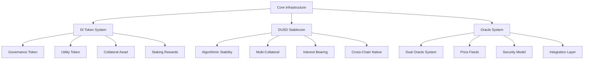
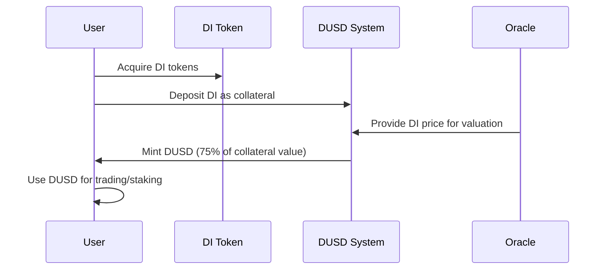
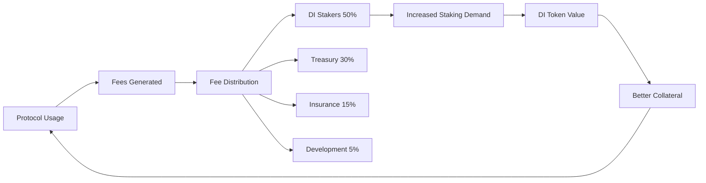

# Core Infrastructure

The Core Infrastructure forms the foundation of DI Network, providing the essential tokens, systems, and mechanisms that power the entire ecosystem.

## Overview

The core infrastructure consists of three main components that work together to provide a stable, secure, and scalable foundation:

## Components

### 🪙 DI Token System

The native governance and utility token that serves multiple critical functions:

- **Governance Rights**: Vote on protocol parameters and upgrades
- **Primary Collateral**: Main collateral asset for DUSD minting
- **Staking Rewards**: Earn 8-20% APY through staking
- **Fee Distribution**: Share in protocol revenue


[di-token](di-token/)


### 💵 DUSD Stablecoin

Over-collateralized algorithmic stablecoin maintaining $1 peg:

- **Stability Mechanism**: Backed by 125%+ collateralization
- **Multi-Collateral Support**: DI, WBTC, WETH, USDT, USDC
- **Interest Bearing**: 5% APR on borrowed DUSD
- **Universal Currency**: Base currency for all protocol operations


[dusd](dusd/)


### 🔮 Oracle System

Dual oracle system providing secure and reliable price feeds:

- **Chainlink Integration**: Primary oracle for stable assets
- **Pyth Network**: High-frequency updates for trading
- **Security Model**: Deviation limits and staleness protection
- **Cross-Chain Support**: Consistent pricing across all networks


[oracle](oracle/)


## Key Features

### Unified Token Economy

All components work together to create a cohesive token economy:

1. **DI tokens** are deposited as collateral
2. **DUSD** is minted against collateral
3. **Oracle prices** determine collateral values
4. **Interest and fees** flow back to DI stakers

### Cross-Chain Consistency

The core infrastructure maintains consistency across all supported networks:

- **Synchronized State**: Oracle prices and parameters sync across chains
- **Unified Governance**: Single governance system controls all deployments
- **Consistent Economics**: Same tokenomics and fee structures everywhere

### Security-First Design

Every component prioritizes security and reliability:

- **Over-Collateralization**: Ensures system solvency
- **Oracle Redundancy**: Multiple price sources prevent manipulation
- **Gradual Rollouts**: New features tested extensively before deployment
- **Emergency Controls**: Circuit breakers and pause mechanisms

## Integration Points

### For Users

The core infrastructure provides the foundation for all user activities:

### For Developers

Clean interfaces and comprehensive documentation:

- **Standardized ABIs**: Consistent contract interfaces
- **SDK Integration**: Easy-to-use JavaScript/TypeScript SDK
- **Event Monitoring**: Comprehensive event emissions
- **Error Handling**: Clear error messages and recovery paths

## Economic Model

### Value Flow

### Revenue Sources

1. **DUSD Interest**: 5% APR on all borrowed DUSD
2. **Trading Fees**: 0.1-0.3% on synthetic asset trades
3. **Liquidation Penalties**: 5% bonus on liquidated positions
4. **Bridge Fees**: Cross-chain transaction fees
5. **Funding Rates**: Perpetual trading funding payments

## Risk Management

### System-Level Protections

- **Over-Collateralization**: Minimum 125% backing for DUSD
- **Oracle Security**: Dual oracle system with deviation limits
- **Liquidation Engine**: Automated position liquidations
- **Insurance Fund**: Protocol reserves for extreme scenarios

### Monitoring & Alerts

- **Health Metrics**: Real-time system health monitoring
- **Risk Parameters**: Dynamic adjustment based on market conditions
- **Emergency Procedures**: Rapid response protocols
- **Community Oversight**: Transparent governance and reporting

## Getting Started

Choose your area of interest:

<table data-view="cards">
<thead>
<tr>
<th></th>
<th></th>
<th data-hidden data-card-target data-type="content-ref"></th>
</tr>
</thead>
<tbody>
<tr>
<td><strong>🪙 DI Token</strong></td>
<td>Learn about governance, staking, and tokenomics</td>
<td><a href="di-token/">di-token</a></td>
</tr>
<tr>
<td><strong>💵 DUSD Stablecoin</strong></td>
<td>Understand stability mechanisms and collateral</td>
<td><a href="dusd/">dusd</a></td>
</tr>
<tr>
<td><strong>🔮 Oracle System</strong></td>
<td>Explore price feeds and security model</td>
<td><a href="oracle/">oracle</a></td>
</tr>
</tbody>
</table>

## Technical Specifications

### Performance Metrics

| Metric | Target | Current |
|--------|--------|---------|
| **Oracle Update Frequency** | 1-60 seconds | ✅ Achieved |
| **Price Deviation Tolerance** | <2% | ✅ Maintained |
| **System Uptime** | >99.9% | ✅ Exceeded |
| **Transaction Finality** | <30 seconds | ✅ Achieved |

### Scalability

- **Multi-Chain Deployment**: 6 networks supported
- **Horizontal Scaling**: Add new chains without core changes
- **Modular Architecture**: Independent component upgrades
- **Load Distribution**: Balanced across multiple networks

---

The Core Infrastructure provides the solid foundation that enables all advanced DI Network features while maintaining security, stability, and scalability.