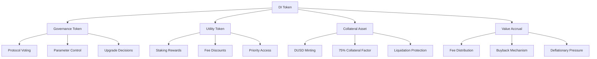
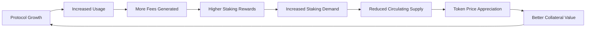

# DI Token System

The DI Token is the native governance and utility token of the DI Network ecosystem, serving as the cornerstone of the protocol's economic model and governance structure.

## Overview

DI Token serves four primary functions that make it essential to the protocol:



## Token Specifications

| Property | Value |
|----------|-------|
| **Name** | DI Token |
| **Symbol** | DI |
| **Type** | ERC20Votes + ERC20Permit |
| **Total Supply** | 1,000,000,000 (1 Billion) |
| **Decimals** | 18 |
| **Mintable** | No (Fixed Supply) |
| **Burnable** | Yes (Through Buybacks) |

## Core Functions

### 1. Governance Token

DI token holders control the protocol through decentralized governance:


[governance.md](governance.md)


### 2. Staking & Rewards

Stake DI tokens to earn rewards and boost governance power:


[staking.md](staking.md)


### 3. Tokenomics & Distribution

Comprehensive token distribution and economic model:


[tokenomics.md](tokenomics.md)


### 4. Token Distribution

Detailed vesting schedules and allocation breakdown:


[distribution.md](distribution.md)


## Key Features

### Multi-Utility Design

Unlike single-purpose tokens, DI serves multiple critical functions:

- **Primary Collateral**: 75% collateral factor for DUSD minting
- **Governance Rights**: Vote on all protocol parameters
- **Staking Rewards**: Earn 8-20% APY based on lock period
- **Fee Sharing**: Receive 50% of all protocol fees

### Cross-Chain Native

DI token operates seamlessly across all supported networks:

- **Unified Supply**: Same token across all chains
- **Synchronized Governance**: Single governance system
- **Cross-Chain Staking**: Stake on any supported network
- **Bridge Integration**: Native cross-chain transfers

### Deflationary Mechanisms

Multiple mechanisms create deflationary pressure:

- **Buyback Program**: Protocol uses revenue to buy back tokens
- **Burn Mechanism**: Bought-back tokens are permanently burned
- **Staking Lock**: Significant portion locked reducing circulating supply
- **Vesting Schedule**: Gradual release over 48 months

## Economic Model

### Value Accrual Mechanisms



### Revenue Streams

1. **Trading Fees**: 0.1-0.3% on synthetic asset trades
2. **Interest Payments**: 5% APR on borrowed DUSD
3. **Liquidation Penalties**: 5% bonus on liquidated positions
4. **Bridge Fees**: Cross-chain transaction fees
5. **Funding Rates**: Perpetual trading funding payments

### Fee Distribution

| Recipient | Percentage | Purpose |
|-----------|------------|---------|
| **DI Stakers** | 50% | Reward token holders |
| **Treasury** | 30% | Protocol development |
| **Insurance Fund** | 15% | Risk management |
| **Development** | 5% | Ongoing maintenance |

## Use Cases

### For Individual Users

- **Governance Participation**: Vote on protocol changes
- **Staking Rewards**: Earn passive income through staking
- **Collateral Usage**: Mint DUSD for trading and DeFi activities
- **Fee Discounts**: Reduced fees across all protocol features

### For Institutions

- **Treasury Management**: Diversified DeFi exposure
- **Governance Influence**: Participate in protocol direction
- **Yield Generation**: Institutional-grade staking rewards
- **Risk Management**: Hedge positions with synthetic assets

### For Developers

- **Integration Rewards**: Earn tokens for protocol integrations
- **Governance Proposals**: Propose technical improvements
- **Fee Sharing**: Revenue sharing for valuable contributions
- **Early Access**: Priority access to new features

## Security Features

### Smart Contract Security

- **Multiple Audits**: Audited by leading security firms
- **Formal Verification**: Critical functions mathematically proven
- **Bug Bounty**: $500K active bug bounty program
- **Gradual Rollout**: Phased deployment with monitoring

### Economic Security

- **Over-Collateralization**: Ensures system solvency
- **Oracle Protection**: Dual oracle system prevents manipulation
- **Liquidation Engine**: Automated risk management
- **Insurance Fund**: Protocol reserves for extreme events

### Governance Security

- **Timelock Delays**: 48-hour delay on critical changes
- **Multi-Signature**: Emergency actions require multiple signatures
- **Proposal Validation**: Technical review before voting
- **Community Oversight**: Transparent governance process

## Integration Guide

### Basic Integration

```javascript
import { DINetwork } from '@dinetwork/sdk';

const di = new DINetwork({
  chainId: 1,
  provider: window.ethereum
});

// Get DI token balance
const balance = await di.tokens.getDIBalance(userAddress);

// Stake DI tokens
await di.staking.stake(amount, lockPeriod);

// Delegate voting power
await di.governance.delegate(delegateAddress);
```

### Advanced Features

```javascript
// Check staking rewards
const rewards = await di.staking.getRewards(userAddress);

// Vote on proposal
await di.governance.vote(proposalId, support);

// Use as collateral
await di.dusd.depositCollateral(amount);
```

## Monitoring & Analytics

### Key Metrics

- **Total Supply**: 1,000,000,000 DI
- **Circulating Supply**: Dynamic based on vesting
- **Staked Amount**: Tokens locked in staking contracts
- **Governance Participation**: Active voters and proposals
- **Price Performance**: Market value and trading volume

### Useful Tools

- **Analytics Dashboard**: [analytics.dinetwork.xyz](https://analytics.dinetwork.xyz)
- **Governance Portal**: [gov.dinetwork.xyz](https://gov.dinetwork.xyz)
- **Staking Interface**: [stake.dinetwork.xyz](https://stake.dinetwork.xyz)
- **Block Explorers**: Etherscan, BscScan, PolygonScan

## Roadmap

### Current Features ✅
- [x] Basic ERC20 functionality
- [x] Governance voting (ERC20Votes)
- [x] Gasless approvals (ERC20Permit)
- [x] Staking with lock periods
- [x] Cross-chain deployment

### Upcoming Features 🔄
- [ ] Enhanced governance features
- [ ] Dynamic staking rewards
- [ ] Cross-chain governance
- [ ] Advanced delegation options

### Future Enhancements 🔜
- [ ] Liquid staking derivatives
- [ ] Governance mining rewards
- [ ] Institutional staking products
- [ ] Advanced tokenomics features

---

The DI Token system provides the economic foundation and governance structure that enables the entire DI Network ecosystem to function as a decentralized, community-owned protocol.