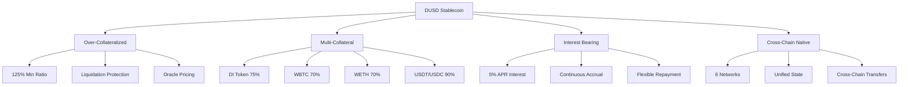
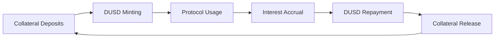

# DUSD Stablecoin

DUSD is DI Network's over-collateralized algorithmic stablecoin, serving as the base currency for all protocol operations and maintaining its $1 peg through robust collateralization mechanisms.

## Overview

DUSD combines the stability of over-collateralization with the flexibility of algorithmic design:



## Key Features

### Stability Mechanism
- **Over-Collateralization**: Minimum 125% backing
- **Oracle Pricing**: Real-time collateral valuation
- **Liquidation Engine**: Automated position management
- **Interest Rates**: 5% APR encourages repayment

### Multi-Collateral Support
- **DI Token**: Primary collateral (75% factor)
- **WBTC**: Bitcoin exposure (70% factor)
- **WETH**: Ethereum exposure (70% factor)
- **USDT/USDC**: Stable collateral (90% factor)

### Cross-Chain Functionality
- **Native Deployment**: Available on all 6 networks
- **Unified Supply**: Same token across chains
- **Bridge Integration**: Seamless cross-chain transfers
- **Gas Payments**: Use DUSD for transaction fees

## Core Functions

### 1. Stability Mechanism
Maintains $1 peg through over-collateralization and market mechanisms.


[stability.md](stability.md)


### 2. Collateral Management
Comprehensive system for managing multiple collateral types.


[collateral.md](collateral.md)


### 3. Interest Rate Model
Fixed 5% APR interest rate system with continuous accrual.


[interest.md](interest.md)


### 4. Liquidation System
Automated liquidation engine protecting protocol solvency.


[liquidations.md](liquidations.md)


## Use Cases

### Trading Base Currency
- **Synthetic Assets**: Mint xBTC, xETH, xAAPL with DUSD
- **Perpetual Trading**: Use as collateral for leveraged positions
- **Spot Trading**: Direct trading pairs with synthetic assets

### Cross-Chain Operations
- **Bridge Currency**: Transfer value between networks
- **Gas Payments**: Pay transaction fees across all chains
- **Liquidity Provision**: Provide liquidity in various pools

### DeFi Integration
- **Lending**: Lend DUSD in external protocols
- **Yield Farming**: Participate in yield farming opportunities
- **Arbitrage**: Exploit price differences across chains

## Economic Model

### Supply Dynamics


### Revenue Generation
- **Interest Payments**: 5% APR on all borrowed DUSD
- **Liquidation Penalties**: 5% bonus on liquidated positions
- **Trading Fees**: Indirect revenue from synthetic trading

### Peg Maintenance
- **Arbitrage Opportunities**: Price deviations create profit opportunities
- **Protocol Reserves**: Emergency reserves for peg defense
- **Market Making**: Automated market making for stability

## Risk Management

### Collateral Risk
- **Diversification**: Multiple collateral types reduce concentration risk
- **Conservative Ratios**: Lower collateral factors provide safety buffer
- **Oracle Security**: Dual oracle system prevents price manipulation

### Systemic Risk
- **Over-Collateralization**: System-wide collateral exceeds DUSD supply
- **Liquidation Engine**: Automated risk management
- **Insurance Fund**: Protocol reserves for extreme scenarios

## Integration Examples

### Basic DUSD Operations
```javascript
import { DINetwork } from '@dinetwork/sdk';

const di = new DINetwork({ chainId: 1, provider: window.ethereum });

// Check borrowing capacity
const capacity = await di.dusd.getBorrowingCapacity(userAddress);

// Mint DUSD with DI collateral
await di.dusd.mint({
  collateralToken: 'DI',
  collateralAmount: ethers.parseEther('1000'),
  dusdAmount: ethers.parseEther('750')
});

// Repay DUSD
await di.dusd.repay(ethers.parseEther('750'));
```

### Position Management
```javascript
// Check position health
const position = await di.dusd.getPosition(userAddress);
const healthFactor = await di.dusd.getHealthFactor(userAddress);

// Add collateral
await di.dusd.addCollateral('DI', ethers.parseEther('500'));

// Partial repayment
await di.dusd.repay(ethers.parseEther('100'));
```

## Monitoring & Analytics

### Key Metrics
- **Total Supply**: Current DUSD in circulation
- **Collateralization Ratio**: System-wide backing ratio
- **Peg Stability**: Price deviation from $1.00
- **Interest Accrued**: Total outstanding interest
- **Liquidation Rate**: Frequency of position liquidations

### Health Indicators
- **System Health**: >150% collateralization (healthy)
- **Peg Stability**: <2% deviation from $1.00
- **Liquidation Frequency**: <1% daily (stable)
- **Interest Coverage**: Sufficient reserves for operations