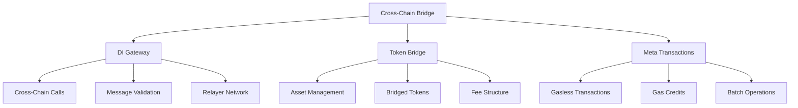
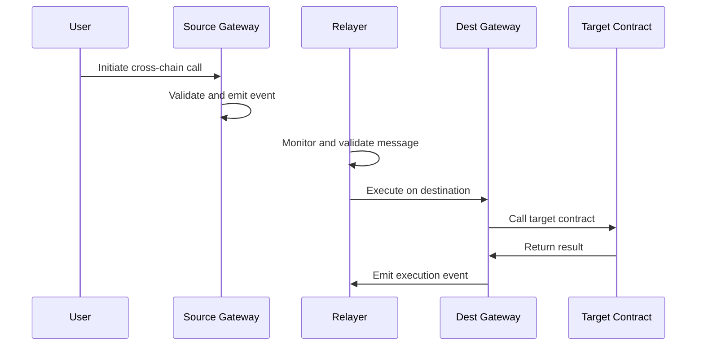
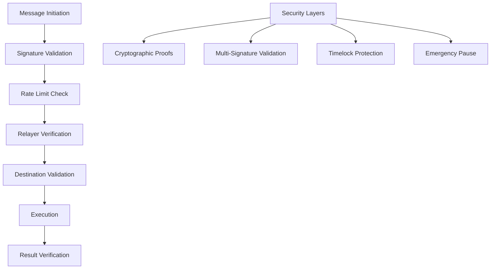
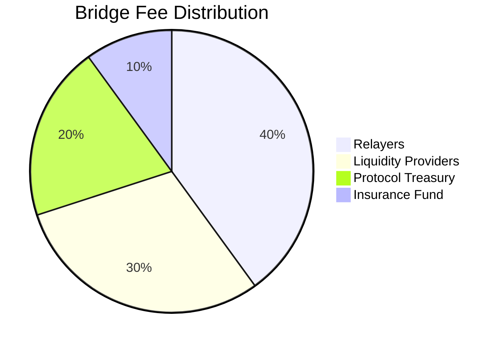

# Cross-Chain Bridge

The Cross-Chain Bridge enables seamless interoperability across multiple blockchain networks, allowing users to transfer assets, execute contracts, and perform gasless transactions across the entire DI Network ecosystem.

## Overview

DI Network's cross-chain infrastructure consists of three main components working together to provide a unified multi-chain experience:



## Supported Networks

| Network | Chain ID | Status | Features |
|---------|----------|--------|----------|
| **Ethereum** | 1 | ✅ Live | Full bridge suite |
| **BSC** | 56 | ✅ Live | Full bridge suite |
| **Polygon** | 137 | ✅ Live | Full bridge suite |
| **Arbitrum** | 42161 | ✅ Live | Full bridge suite |
| **Base** | 8453 | ✅ Live | Full bridge suite |
| **Crossfi** | 4157 | ✅ Live | Full bridge suite |

## Core Components

### 🌉 DI Gateway

The main cross-chain communication protocol enabling contract calls across networks:

- **Cross-Chain Calls**: Execute functions on destination chains
- **Message Validation**: Secure message verification and replay protection
- **Relayer Network**: Decentralized network for message execution
- **Security Model**: Multi-signature validation and timelock protection


[gateway](gateway/)


### 🔄 Token Bridge

Secure asset transfer system supporting multiple token types:

- **Asset Management**: Comprehensive token registry and configuration
- **Bridged Tokens**: Wrapped token system for cross-chain assets
- **Fee Structure**: Transparent and competitive bridge fees
- **Liquidity Management**: Optimized liquidity across all networks


[bridge](bridge/)


### ⚡ Meta Transactions

Revolutionary gasless transaction system using DUSD for gas payments:

- **Gasless Transactions**: Pay fees in DUSD instead of native tokens
- **Gas Credits**: Deposit DUSD to build up gas credits
- **Batch Operations**: Execute multiple operations in single transaction
- **Universal Gas**: Same gas token (DUSD) across all networks


[meta-tx](meta-tx/)


## Key Features

### Unified Multi-Chain Experience

Unlike traditional bridges that require separate interactions per chain, DI Network provides:

- **Single Interface**: One UI for all supported networks
- **Shared State**: Synchronized data across all chains
- **Cross-Chain Positions**: Open on one chain, close on another
- **Unified Liquidity**: Shared liquidity pools across networks

### Security-First Design

Every component prioritizes security and decentralization:

- **Decentralized Relayers**: No single point of failure
- **Message Validation**: Cryptographic proof verification
- **Rate Limiting**: Protection against spam and attacks
- **Emergency Controls**: Circuit breakers and pause mechanisms

### Developer-Friendly

Comprehensive tools and documentation for easy integration:

- **Simple APIs**: Easy-to-use SDK methods
- **Event Monitoring**: Real-time cross-chain event tracking
- **Error Handling**: Clear error messages and recovery paths
- **Testing Tools**: Comprehensive testnet support

## Architecture

### Message Flow



### Security Model



## Use Cases

### For Users

- **Asset Bridging**: Transfer tokens between any supported networks
- **Cross-Chain Trading**: Trade on the best liquidity across chains
- **Gasless Operations**: Use DUSD for gas fees on any network
- **Portfolio Management**: Manage assets across multiple chains

### For Developers

- **Cross-Chain dApps**: Build applications spanning multiple networks
- **Unified State**: Maintain consistent state across chains
- **Gas Abstraction**: Abstract away native gas requirements
- **Event Monitoring**: Track cross-chain events and state changes

### For Institutions

- **Treasury Management**: Efficiently manage multi-chain treasuries
- **Arbitrage Opportunities**: Exploit price differences across chains
- **Risk Distribution**: Spread risk across multiple networks
- **Compliance**: Maintain audit trails across all chains

## Economic Model

### Fee Structure

| Operation | Fee | Recipient |
|-----------|-----|-----------|
| **Cross-Chain Call** | 0.1% + Gas | Relayers + Protocol |
| **Token Bridge** | 0.05-0.2% | Liquidity Providers |
| **Gasless Transaction** | Gas Cost in DUSD | Relayers |
| **Batch Operation** | Reduced per-tx cost | Relayers |

### Revenue Distribution



## Integration Examples

### Basic Cross-Chain Call

```javascript
import { DINetwork } from '@dinetwork/sdk';

const di = new DINetwork({
  chainId: 1, // Ethereum
  provider: window.ethereum
});

// Execute function on BSC from Ethereum
await di.bridge.callContract({
  destinationChainId: 56, // BSC
  targetContract: '0x...',
  functionData: encodedCall,
  gasLimit: 200000
});
```

### Token Bridging

```javascript
// Bridge DUSD from Ethereum to Polygon
await di.bridge.bridgeToken({
  token: 'DUSD',
  amount: ethers.parseEther('1000'),
  destinationChainId: 137, // Polygon
  recipient: userAddress
});
```

### Gasless Transactions

```javascript
// Deposit gas credits
await di.bridge.depositGasCredits(ethers.parseEther('100'));

// Execute gasless transaction
const metaTx = {
  to: targetContract,
  data: encodedCall,
  gasToken: 'DUSD'
};

await di.bridge.executeGaslessTransaction(metaTx);
```

## Monitoring & Analytics

### Key Metrics

- **Cross-Chain Volume**: Total value transferred across chains
- **Message Success Rate**: Percentage of successful cross-chain calls
- **Average Confirmation Time**: Time from initiation to execution
- **Gas Credit Usage**: DUSD consumed for gasless transactions
- **Network Utilization**: Usage distribution across chains

### Real-Time Monitoring

- **Bridge Status**: Live status of all bridge components
- **Relayer Health**: Performance metrics for relayer network
- **Queue Status**: Pending cross-chain messages
- **Fee Tracking**: Real-time fee calculations and distributions

## Security Considerations

### Risk Mitigation

- **Decentralized Relayers**: Multiple independent relayers
- **Message Validation**: Cryptographic proof verification
- **Rate Limiting**: Protection against spam attacks
- **Emergency Procedures**: Rapid response to security issues

### Best Practices

- **Start Small**: Test with small amounts first
- **Verify Addresses**: Always double-check destination addresses
- **Monitor Status**: Track transaction status across chains
- **Keep Records**: Maintain transaction history for auditing

## Roadmap

### Current Features ✅
- [x] Basic cross-chain calls
- [x] Token bridging
- [x] Gasless transactions
- [x] Multi-chain deployment

### In Development 🔄
- [ ] Advanced order routing
- [ ] Cross-chain governance
- [ ] Enhanced security features
- [ ] Performance optimizations

### Future Plans 🔜
- [ ] Additional network support
- [ ] Layer 2 integrations
- [ ] Advanced bridging features
- [ ] Institutional tools

---

The Cross-Chain Bridge provides the infrastructure that makes DI Network truly multi-chain, enabling seamless interoperability and unified user experiences across all supported blockchain networks.