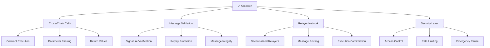
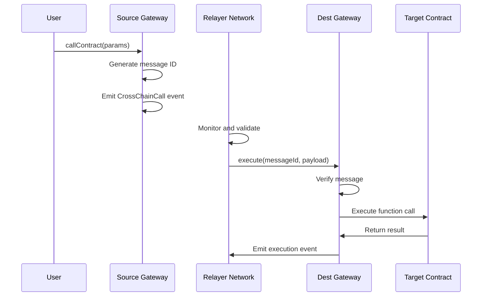

# DI Gateway

DI Gateway is the core cross-chain communication protocol that enables smart contract calls and message passing between different blockchain networks.

## Overview

DI Gateway provides secure, decentralized cross-chain communication:



## Core Functions

### 1. Cross-Chain Calls
Execute smart contract functions on destination chains.


[calls.md](calls.md)


### 2. Message Validation
Secure message verification and replay protection.


[validation.md](validation.md)


### 3. Security Model
Comprehensive security framework for cross-chain operations.


[security.md](security.md)


## Key Features

### Decentralized Architecture
- **No Single Point of Failure**: Multiple independent relayers
- **Consensus Mechanism**: Multiple confirmations required
- **Slashing Conditions**: Penalties for malicious behavior
- **Economic Incentives**: Rewards for honest relayers

### Universal Compatibility
- **Any Contract**: Call any smart contract function
- **Any Network**: Support for all EVM-compatible chains
- **Any Data**: Pass complex data structures
- **Any Value**: Transfer ETH/native tokens with calls

### Security First
- **Cryptographic Proofs**: Message authenticity verification
- **Replay Protection**: Prevent duplicate executions
- **Rate Limiting**: Prevent spam attacks
- **Emergency Controls**: Pause mechanism for security

## Architecture

### Message Flow


### Contract Interface
```solidity
interface IDIGateway {
    function callContract(
        uint256 destinationChainId,
        address destinationContract,
        bytes calldata payload,
        address gasToken,
        uint256 gasLimit
    ) external payable;
    
    function callContractWithToken(
        uint256 destinationChainId,
        address destinationContract,
        bytes calldata payload,
        string memory symbol,
        uint256 amount,
        address gasToken,
        uint256 gasLimit
    ) external payable;
    
    function execute(
        bytes32 messageId,
        uint256 sourceChainId,
        address sourceAddress,
        address destinationContract,
        bytes calldata payload
    ) external;
}
```

## Integration Examples

### Basic Cross-Chain Call
```javascript
// Execute function on destination chain
await di.gateway.callContract({
  destinationChainId: 56, // BSC
  destinationContract: '0x...',
  payload: encodedFunctionCall,
  gasToken: 'DUSD',
  gasLimit: 200000
});
```

### Cross-Chain Call with Token Transfer
```javascript
// Send tokens and execute function
await di.gateway.callContractWithToken({
  destinationChainId: 137, // Polygon
  destinationContract: '0x...',
  payload: encodedFunctionCall,
  symbol: 'DUSD',
  amount: ethers.parseEther('1000'),
  gasToken: 'DUSD',
  gasLimit: 300000
});
```

## Supported Operations

### Contract Calls
- **Function Execution**: Call any public/external function
- **Parameter Passing**: Support for complex data types
- **Return Values**: Capture and relay return data
- **Event Emission**: Cross-chain event notifications

### Token Operations
- **Token Transfers**: Send tokens with contract calls
- **Multi-Token**: Support for multiple token types
- **Atomic Operations**: All-or-nothing execution
- **Fee Handling**: Automatic fee deduction

### Gas Management
- **Gas Estimation**: Accurate gas cost prediction
- **Gas Token**: Pay fees in DUSD or native tokens
- **Gas Limits**: Configurable execution limits
- **Refund Mechanism**: Unused gas refunds

## Performance Metrics

### Speed
- **Average Confirmation**: 2-5 minutes
- **Fast Track**: <1 minute for urgent calls
- **Batch Processing**: Multiple calls in single transaction
- **Parallel Execution**: Concurrent cross-chain operations

### Reliability
- **Success Rate**: >99.5% message delivery
- **Uptime**: >99.9% gateway availability
- **Redundancy**: Multiple relayer backup
- **Recovery**: Automatic retry mechanisms

### Cost
- **Base Fee**: 0.1% of transaction value
- **Gas Optimization**: Efficient execution paths
- **Bulk Discounts**: Reduced fees for high volume
- **DUSD Payments**: Unified gas payment system