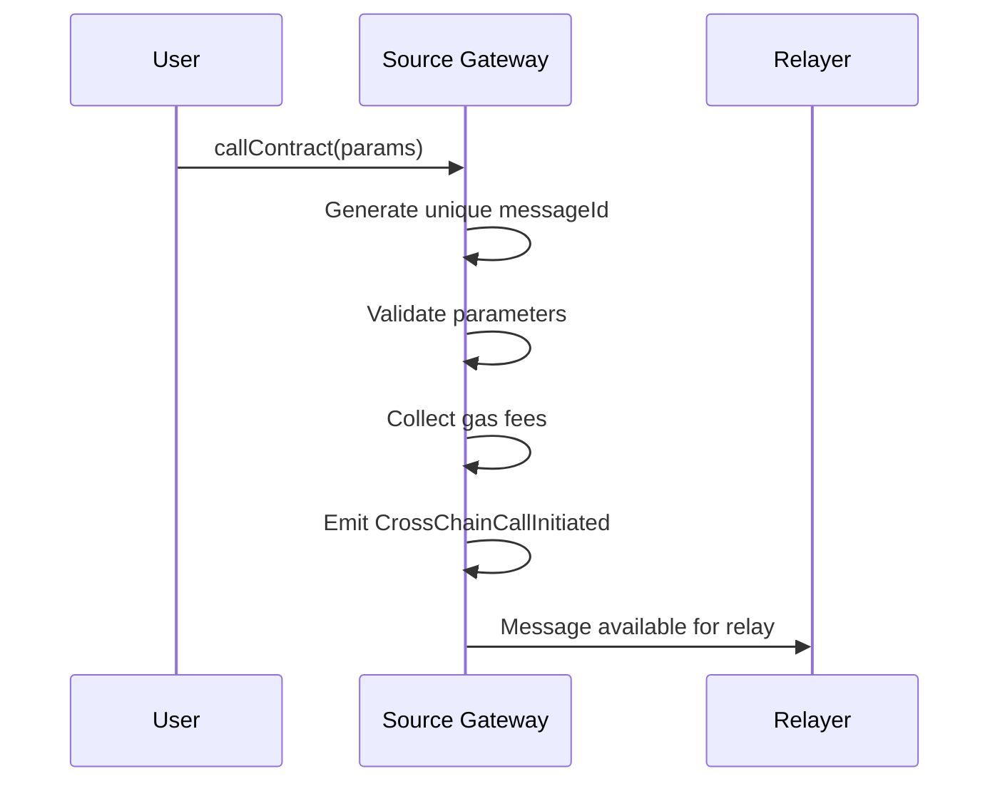
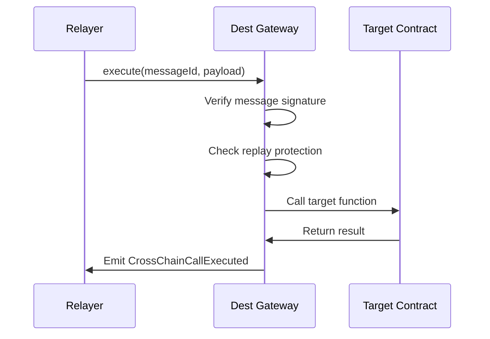

# Cross-Chain Calls

Execute smart contract functions across different blockchain networks using DI Gateway's secure cross-chain communication protocol.

## Call Types

### Simple Contract Call
Execute a function on a destination chain without token transfers:

```javascript
await di.gateway.callContract({
  destinationChainId: 56, // BSC
  destinationContract: '0x742d35Cc6634C0532925a3b8D400E4C0C0b8C8e0',
  payload: encodedFunctionCall,
  gasToken: 'DUSD',
  gasLimit: 200000
});
```

### Contract Call with Token Transfer
Send tokens along with the contract call:

```javascript
await di.gateway.callContractWithToken({
  destinationChainId: 137, // Polygon
  destinationContract: '0x742d35Cc6634C0532925a3b8D400E4C0C0b8C8e0',
  payload: encodedFunctionCall,
  symbol: 'DUSD',
  amount: ethers.parseEther('1000'),
  gasToken: 'DUSD',
  gasLimit: 300000
});
```

## Function Encoding

### Basic Function Call
```javascript
// Encode function call
const iface = new ethers.Interface([
  'function updateValue(uint256 newValue)'
]);

const payload = iface.encodeFunctionData('updateValue', [42]);

await di.gateway.callContract({
  destinationChainId: 42161, // Arbitrum
  destinationContract: targetContract,
  payload: payload,
  gasToken: 'DUSD',
  gasLimit: 150000
});
```

### Complex Function Call
```javascript
// Encode complex function with multiple parameters
const iface = new ethers.Interface([
  'function processData(address user, uint256[] amounts, bytes data)'
]);

const payload = iface.encodeFunctionData('processData', [
  userAddress,
  [ethers.parseEther('100'), ethers.parseEther('200')],
  ethers.toUtf8Bytes('metadata')
]);

await di.gateway.callContract({
  destinationChainId: 8453, // Base
  destinationContract: targetContract,
  payload: payload,
  gasToken: 'DUSD',
  gasLimit: 250000
});
```

## Execution Flow

### Message Creation


### Message Execution


## Gas Management

### Gas Estimation
```javascript
// Estimate gas for cross-chain call
const gasEstimate = await di.gateway.estimateGas({
  destinationChainId: 56,
  destinationContract: targetContract,
  payload: encodedCall
});

console.log(`Estimated gas: ${gasEstimate.gasLimit}`);
console.log(`Estimated cost: ${ethers.formatEther(gasEstimate.totalCost)} DUSD`);
```

### Gas Token Options
```javascript
// Pay with DUSD (recommended)
await di.gateway.callContract({
  // ... other params
  gasToken: 'DUSD',
  gasLimit: 200000
});

// Pay with native token
await di.gateway.callContract({
  // ... other params
  gasToken: ethers.ZeroAddress, // Native token
  gasLimit: 200000
}, { value: ethers.parseEther('0.01') });
```

## Advanced Features

### Batch Calls
```javascript
// Execute multiple calls in sequence
const calls = [
  {
    destinationChainId: 56,
    destinationContract: contract1,
    payload: payload1
  },
  {
    destinationChainId: 137,
    destinationContract: contract2,
    payload: payload2
  }
];

await di.gateway.batchCallContract(calls, {
  gasToken: 'DUSD',
  gasLimit: 500000
});
```

### Conditional Execution
```javascript
// Execute call only if condition is met
await di.gateway.callContractConditional({
  destinationChainId: 42161,
  destinationContract: targetContract,
  payload: encodedCall,
  condition: {
    type: 'BALANCE_GREATER_THAN',
    token: 'DUSD',
    amount: ethers.parseEther('100')
  },
  gasToken: 'DUSD',
  gasLimit: 200000
});
```

## Error Handling

### Common Errors
```javascript
try {
  await di.gateway.callContract(params);
} catch (error) {
  if (error.code === 'INSUFFICIENT_GAS') {
    console.log('Increase gas limit');
  } else if (error.code === 'INVALID_DESTINATION') {
    console.log('Check destination chain and contract');
  } else if (error.code === 'EXECUTION_FAILED') {
    console.log('Target contract call failed');
  }
}
```

### Retry Mechanism
```javascript
// Automatic retry with exponential backoff
const retryCall = async (params, maxRetries = 3) => {
  for (let i = 0; i < maxRetries; i++) {
    try {
      return await di.gateway.callContract(params);
    } catch (error) {
      if (i === maxRetries - 1) throw error;
      await new Promise(resolve => setTimeout(resolve, 1000 * Math.pow(2, i)));
    }
  }
};
```

## Monitoring & Tracking

### Message Status
```javascript
// Track message status
const messageId = await di.gateway.callContract(params);

// Check status
const status = await di.gateway.getMessageStatus(messageId);
console.log({
  status: status.status, // 'pending', 'executed', 'failed'
  confirmations: status.confirmations,
  executionResult: status.result
});
```

### Event Monitoring
```javascript
// Listen for cross-chain call events
di.gateway.on('CrossChainCallInitiated', (event) => {
  console.log('Call initiated:', {
    messageId: event.messageId,
    destinationChain: event.destinationChainId,
    contract: event.destinationContract
  });
});

di.gateway.on('CrossChainCallExecuted', (event) => {
  console.log('Call executed:', {
    messageId: event.messageId,
    success: event.success,
    result: event.result
  });
});
```

## Best Practices

### Security
1. **Validate Inputs**: Always validate function parameters
2. **Access Control**: Implement proper access controls on target contracts
3. **Reentrancy Protection**: Use reentrancy guards
4. **Gas Limits**: Set appropriate gas limits

### Efficiency
1. **Batch Operations**: Group multiple calls when possible
2. **Gas Optimization**: Use efficient encoding
3. **Minimal Data**: Send only necessary data
4. **Caching**: Cache frequently used data

### Reliability
1. **Error Handling**: Implement comprehensive error handling
2. **Retry Logic**: Add retry mechanisms for failed calls
3. **Monitoring**: Monitor call status and results
4. **Fallback**: Have fallback mechanisms for critical operations

## Integration Examples

### DeFi Protocol Integration
```javascript
// Cross-chain yield farming
const farmOnPolygon = async (amount) => {
  const payload = farmContract.interface.encodeFunctionData('deposit', [amount]);
  
  await di.gateway.callContractWithToken({
    destinationChainId: 137, // Polygon
    destinationContract: farmContract.address,
    payload: payload,
    symbol: 'DUSD',
    amount: amount,
    gasToken: 'DUSD',
    gasLimit: 300000
  });
};
```

### NFT Cross-Chain Transfer
```javascript
// Transfer NFT to another chain
const transferNFT = async (tokenId, recipient) => {
  const payload = nftContract.interface.encodeFunctionData('crossChainTransfer', [
    tokenId,
    recipient,
    56 // destination chain (BSC)
  ]);
  
  await di.gateway.callContract({
    destinationChainId: 56,
    destinationContract: nftContract.address,
    payload: payload,
    gasToken: 'DUSD',
    gasLimit: 200000
  });
};
```

### Governance Cross-Chain Execution
```javascript
// Execute governance decision across chains
const executeGovernanceAction = async (proposalId) => {
  const payload = governanceContract.interface.encodeFunctionData('executeProposal', [proposalId]);
  
  // Execute on multiple chains
  const chains = [56, 137, 42161]; // BSC, Polygon, Arbitrum
  
  for (const chainId of chains) {
    await di.gateway.callContract({
      destinationChainId: chainId,
      destinationContract: governanceContract.address,
      payload: payload,
      gasToken: 'DUSD',
      gasLimit: 250000
    });
  }
};
```