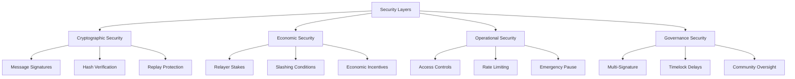

# DI Gateway Security

DI Gateway implements multiple security layers to protect against attacks and ensure reliable cross-chain communication.

## Security Architecture



## Cryptographic Security

### Message Authentication
```solidity
function authenticateMessage(
    CrossChainMessage memory message,
    bytes memory signature
) internal view returns (bool) {
    bytes32 messageHash = keccak256(abi.encode(
        message.messageId,
        message.sourceChainId,
        message.destinationChainId,
        message.sourceAddress,
        message.destinationContract,
        message.payload,
        message.nonce,
        message.timestamp
    ));
    
    bytes32 ethSignedMessageHash = ECDSA.toEthSignedMessageHash(messageHash);
    address recoveredSigner = ECDSA.recover(ethSignedMessageHash, signature);
    
    return recoveredSigner == message.sourceAddress;
}
```

### Hash Chain Verification
```solidity
mapping(bytes32 => bytes32) public messageHashes;
mapping(bytes32 => bool) public verifiedMessages;

function verifyMessageChain(bytes32 messageId, bytes32 previousHash) internal view returns (bool) {
    return messageHashes[messageId] == keccak256(abi.encodePacked(previousHash, messageId));
}
```

## Economic Security

### Relayer Staking
```solidity
struct RelayerInfo {
    uint256 stake;
    uint256 successfulRelays;
    uint256 failedRelays;
    uint256 slashedAmount;
    bool isActive;
}

mapping(address => RelayerInfo) public relayers;
uint256 public constant MIN_RELAYER_STAKE = 10000e18; // 10,000 DI tokens

function addRelayer(address relayer) external payable {
    require(msg.value >= MIN_RELAYER_STAKE, "Insufficient stake");
    
    relayers[relayer] = RelayerInfo({
        stake: msg.value,
        successfulRelays: 0,
        failedRelays: 0,
        slashedAmount: 0,
        isActive: true
    });
    
    _grantRole(RELAYER_ROLE, relayer);
}
```

### Slashing Mechanism
```solidity
uint256 public constant SLASH_PERCENTAGE = 1000; // 10%

function slashRelayer(address relayer, string memory reason) external onlyAdmin {
    RelayerInfo storage info = relayers[relayer];
    require(info.isActive, "Relayer not active");
    
    uint256 slashAmount = (info.stake * SLASH_PERCENTAGE) / BASIS_POINTS;
    info.slashedAmount += slashAmount;
    info.stake -= slashAmount;
    
    if (info.stake < MIN_RELAYER_STAKE) {
        info.isActive = false;
        _revokeRole(RELAYER_ROLE, relayer);
    }
    
    emit RelayerSlashed(relayer, slashAmount, reason);
}
```

## Operational Security

### Access Control Matrix
```solidity
// Role definitions
bytes32 public constant ADMIN_ROLE = keccak256("ADMIN_ROLE");
bytes32 public constant RELAYER_ROLE = keccak256("RELAYER_ROLE");
bytes32 public constant PAUSER_ROLE = keccak256("PAUSER_ROLE");

// Permission matrix
mapping(bytes32 => mapping(bytes4 => bool)) public rolePermissions;

function initializePermissions() internal {
    // Admin permissions
    rolePermissions[ADMIN_ROLE][this.addRelayer.selector] = true;
    rolePermissions[ADMIN_ROLE][this.removeRelayer.selector] = true;
    rolePermissions[ADMIN_ROLE][this.updateParameters.selector] = true;
    
    // Relayer permissions
    rolePermissions[RELAYER_ROLE][this.execute.selector] = true;
    rolePermissions[RELAYER_ROLE][this.validateMessage.selector] = true;
    
    // Pauser permissions
    rolePermissions[PAUSER_ROLE][this.pause.selector] = true;
    rolePermissions[PAUSER_ROLE][this.unpause.selector] = true;
}
```

### Rate Limiting Implementation
```solidity
struct RateLimit {
    uint256 maxRequests;
    uint256 windowSize;
    mapping(address => uint256) requestCounts;
    mapping(address => uint256) windowStart;
}

RateLimit public userRateLimit = RateLimit({
    maxRequests: 10,
    windowSize: 1 hours
});

modifier rateLimited() {
    uint256 currentWindow = block.timestamp / userRateLimit.windowSize;
    uint256 userWindow = userRateLimit.windowStart[msg.sender];
    
    if (currentWindow > userWindow) {
        userRateLimit.requestCounts[msg.sender] = 0;
        userRateLimit.windowStart[msg.sender] = currentWindow;
    }
    
    require(
        userRateLimit.requestCounts[msg.sender] < userRateLimit.maxRequests,
        "Rate limit exceeded"
    );
    
    userRateLimit.requestCounts[msg.sender]++;
    _;
}
```

### Emergency Pause
```solidity
bool public emergencyPaused;
address public emergencyPauser;

modifier whenNotPaused() {
    require(!emergencyPaused, "Contract is paused");
    _;
}

function emergencyPause() external {
    require(
        hasRole(PAUSER_ROLE, msg.sender) || msg.sender == emergencyPauser,
        "Not authorized to pause"
    );
    
    emergencyPaused = true;
    emit EmergencyPaused(msg.sender);
}
```

## Attack Prevention

### Common Attack Vectors

#### 1. Replay Attacks
**Prevention**:
- Unique message IDs
- Nonce tracking
- Execution status tracking

```solidity
function preventReplay(bytes32 messageId, uint256 nonce, address sender) internal {
    require(!executedMessages[messageId], "Message replayed");
    require(nonce == nonces[sender] + 1, "Invalid nonce");
    
    executedMessages[messageId] = true;
    nonces[sender] = nonce;
}
```

#### 2. Message Tampering
**Prevention**:
- Cryptographic signatures
- Hash verification
- Immutable message structure

```solidity
function preventTampering(CrossChainMessage memory message, bytes memory signature) internal view {
    require(authenticateMessage(message, signature), "Message tampered");
    require(validateMessageHash(message), "Hash mismatch");
}
```

#### 3. Relayer Collusion
**Prevention**:
- Multiple relayer requirement
- Economic penalties
- Reputation system

```solidity
uint256 public constant MIN_RELAYER_CONFIRMATIONS = 3;

function requireMultipleConfirmations(bytes32 messageId) internal view {
    require(
        getConfirmationCount(messageId) >= MIN_RELAYER_CONFIRMATIONS,
        "Insufficient confirmations"
    );
}
```

## Monitoring & Detection

### Anomaly Detection
```javascript
class SecurityMonitor {
  constructor() {
    this.metrics = {
      failureRate: 0,
      averageGasUsed: 0,
      suspiciousPatterns: []
    };
  }
  
  async monitorMessages() {
    const recentMessages = await gateway.getRecentMessages(100);
    
    // Check failure rate
    const failures = recentMessages.filter(m => !m.success).length;
    this.metrics.failureRate = failures / recentMessages.length;
    
    if (this.metrics.failureRate > 0.1) {
      this.alertHighFailureRate();
    }
    
    // Check for suspicious patterns
    this.detectSuspiciousPatterns(recentMessages);
  }
  
  detectSuspiciousPatterns(messages) {
    // Detect rapid-fire messages from same address
    const addressCounts = {};
    messages.forEach(msg => {
      addressCounts[msg.sourceAddress] = (addressCounts[msg.sourceAddress] || 0) + 1;
    });
    
    Object.entries(addressCounts).forEach(([address, count]) => {
      if (count > 20) { // More than 20 messages in recent batch
        this.alertSuspiciousActivity(address, count);
      }
    });
  }
}
```

### Security Alerts
```javascript
// Security alert system
const securityAlerts = {
  HIGH_FAILURE_RATE: 'High message failure rate detected',
  SUSPICIOUS_ACTIVITY: 'Suspicious activity from address',
  RELAYER_OFFLINE: 'Relayer appears to be offline',
  UNUSUAL_GAS_USAGE: 'Unusual gas usage pattern detected'
};

const sendSecurityAlert = (alertType, details) => {
  console.error(`SECURITY ALERT: ${securityAlerts[alertType]}`, details);
  // Implement notification system (Discord, email, etc.)
};
```

## Security Best Practices

### For Users
1. **Verify Addresses**: Always double-check contract addresses
2. **Start Small**: Test with small amounts first
3. **Monitor Transactions**: Track cross-chain call status
4. **Use Official Interfaces**: Only use official DI Network interfaces

### For Developers
1. **Input Validation**: Validate all inputs before cross-chain calls
2. **Error Handling**: Implement comprehensive error handling
3. **Access Controls**: Use proper access controls on target contracts
4. **Testing**: Thoroughly test cross-chain integrations

### For Relayers
1. **Secure Infrastructure**: Use secure servers and key management
2. **Monitoring**: Implement comprehensive monitoring systems
3. **Backup Systems**: Have redundant systems for reliability
4. **Incident Response**: Have procedures for security incidents

## Incident Response

### Response Procedures
1. **Detection**: Automated monitoring or community reports
2. **Assessment**: Rapid evaluation of threat severity
3. **Containment**: Emergency pause if necessary
4. **Investigation**: Detailed analysis of the incident
5. **Resolution**: Implement fixes and resume operations
6. **Post-Mortem**: Document lessons learned and improvements

### Emergency Contacts
- **Security Team**: security@dinetwork.xyz
- **Emergency Pause**: Multi-signature wallet holders
- **Community**: Discord #security-alerts channel