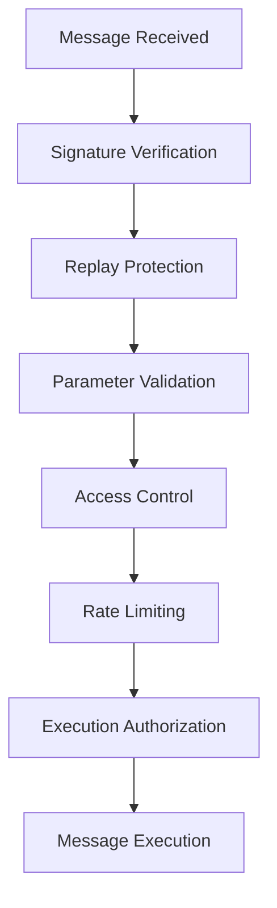

# Message Validation

DI Gateway implements comprehensive message validation to ensure secure and reliable cross-chain communication.

## Validation Framework



## Message Structure

### Cross-Chain Message Format
```solidity
struct CrossChainMessage {
    bytes32 messageId;           // Unique message identifier
    uint256 sourceChainId;       // Origin chain ID
    uint256 destinationChainId;  // Target chain ID
    address sourceAddress;       // Sender address
    address destinationContract; // Target contract
    bytes payload;               // Function call data
    uint256 gasLimit;           // Execution gas limit
    address gasToken;           // Gas payment token
    uint256 nonce;              // Sender nonce
    uint256 timestamp;          // Message timestamp
    bytes signature;            // Message signature
}
```

### Message ID Generation
```solidity
function generateMessageId(
    uint256 sourceChainId,
    uint256 destinationChainId,
    address sourceAddress,
    address destinationContract,
    bytes calldata payload,
    uint256 nonce
) public pure returns (bytes32) {
    return keccak256(abi.encodePacked(
        sourceChainId,
        destinationChainId,
        sourceAddress,
        destinationContract,
        payload,
        nonce,
        block.timestamp
    ));
}
```

## Signature Verification

### Message Signing
```javascript
// Create message hash for signing
const createMessageHash = (message) => {
  return ethers.solidityPackedKeccak256(
    ['bytes32', 'uint256', 'uint256', 'address', 'address', 'bytes', 'uint256'],
    [
      message.messageId,
      message.sourceChainId,
      message.destinationChainId,
      message.sourceAddress,
      message.destinationContract,
      message.payload,
      message.nonce
    ]
  );
};

// Sign message
const messageHash = createMessageHash(message);
const signature = await signer.signMessage(ethers.getBytes(messageHash));
```

### Signature Validation
```solidity
function validateSignature(
    CrossChainMessage memory message,
    bytes memory signature
) internal view returns (bool) {
    bytes32 messageHash = keccak256(abi.encodePacked(
        message.messageId,
        message.sourceChainId,
        message.destinationChainId,
        message.sourceAddress,
        message.destinationContract,
        message.payload,
        message.nonce
    ));
    
    bytes32 ethSignedMessageHash = ECDSA.toEthSignedMessageHash(messageHash);
    address recoveredSigner = ECDSA.recover(ethSignedMessageHash, signature);
    
    return recoveredSigner == message.sourceAddress;
}
```

## Replay Protection

### Nonce Management
```solidity
mapping(address => uint256) public nonces;
mapping(bytes32 => bool) public executedMessages;

function validateNonce(address sender, uint256 nonce) internal view returns (bool) {
    return nonce == nonces[sender] + 1;
}

function incrementNonce(address sender) internal {
    nonces[sender]++;
}
```

### Message Execution Tracking
```solidity
function execute(
    bytes32 messageId,
    uint256 sourceChainId,
    address sourceAddress,
    address destinationContract,
    bytes calldata payload
) external onlyRelayer {
    require(!executedMessages[messageId], "Message already executed");
    
    // Validate message
    require(validateMessage(messageId, sourceChainId, sourceAddress, payload), "Invalid message");
    
    // Mark as executed
    executedMessages[messageId] = true;
    
    // Execute call
    (bool success, bytes memory result) = destinationContract.call(payload);
    
    emit CrossChainCallExecuted(messageId, sourceChainId, sourceAddress, destinationContract, success, result);
}
```

## Parameter Validation

### Input Sanitization
```solidity
function validateCallParameters(
    uint256 destinationChainId,
    address destinationContract,
    bytes calldata payload,
    uint256 gasLimit
) internal view returns (bool) {
    // Validate destination chain
    require(supportedChains[destinationChainId], "Unsupported destination chain");
    
    // Validate contract address
    require(destinationContract != address(0), "Invalid destination contract");
    
    // Validate payload size
    require(payload.length <= MAX_PAYLOAD_SIZE, "Payload too large");
    
    // Validate gas limit
    require(gasLimit >= MIN_GAS_LIMIT && gasLimit <= MAX_GAS_LIMIT, "Invalid gas limit");
    
    return true;
}
```

### Chain Validation
```solidity
mapping(uint256 => bool) public supportedChains;
mapping(uint256 => address) public gatewayAddresses;

function validateChain(uint256 chainId) internal view returns (bool) {
    return supportedChains[chainId] && gatewayAddresses[chainId] != address(0);
}
```

## Access Control

### Role-Based Permissions
```solidity
bytes32 public constant RELAYER_ROLE = keccak256("RELAYER_ROLE");
bytes32 public constant ADMIN_ROLE = keccak256("ADMIN_ROLE");

modifier onlyRelayer() {
    require(hasRole(RELAYER_ROLE, msg.sender), "Not authorized relayer");
    _;
}

modifier onlyAdmin() {
    require(hasRole(ADMIN_ROLE, msg.sender), "Not authorized admin");
    _;
}
```

### Relayer Management
```solidity
mapping(address => bool) public authorizedRelayers;
mapping(address => uint256) public relayerStake;

function addRelayer(address relayer, uint256 stake) external onlyAdmin {
    require(stake >= MIN_RELAYER_STAKE, "Insufficient stake");
    
    authorizedRelayers[relayer] = true;
    relayerStake[relayer] = stake;
    
    _grantRole(RELAYER_ROLE, relayer);
    
    emit RelayerAdded(relayer, stake);
}
```

## Rate Limiting

### Per-User Rate Limits
```solidity
mapping(address => uint256) public lastTransactionTime;
mapping(address => uint256) public transactionCount;

uint256 public constant RATE_LIMIT_WINDOW = 1 hours;
uint256 public constant MAX_TRANSACTIONS_PER_HOUR = 10;

modifier rateLimited() {
    if (block.timestamp - lastTransactionTime[msg.sender] > RATE_LIMIT_WINDOW) {
        transactionCount[msg.sender] = 0;
        lastTransactionTime[msg.sender] = block.timestamp;
    }
    
    require(transactionCount[msg.sender] < MAX_TRANSACTIONS_PER_HOUR, "Rate limit exceeded");
    transactionCount[msg.sender]++;
    _;
}
```

### Global Rate Limits
```solidity
uint256 public globalTransactionCount;
uint256 public lastGlobalReset;
uint256 public constant GLOBAL_RATE_LIMIT = 1000; // per hour

modifier globalRateLimited() {
    if (block.timestamp - lastGlobalReset > 1 hours) {
        globalTransactionCount = 0;
        lastGlobalReset = block.timestamp;
    }
    
    require(globalTransactionCount < GLOBAL_RATE_LIMIT, "Global rate limit exceeded");
    globalTransactionCount++;
    _;
}
```

## Security Validations

### Message Integrity
```javascript
// Validate message integrity
const validateMessageIntegrity = (message, signature) => {
  // Check message structure
  if (!message.messageId || !message.sourceChainId || !message.destinationChainId) {
    throw new Error('Invalid message structure');
  }
  
  // Verify signature
  const messageHash = createMessageHash(message);
  const recoveredAddress = ethers.verifyMessage(messageHash, signature);
  
  if (recoveredAddress !== message.sourceAddress) {
    throw new Error('Invalid signature');
  }
  
  return true;
};
```

### Timestamp Validation
```solidity
uint256 public constant MAX_MESSAGE_AGE = 1 hours;

function validateTimestamp(uint256 timestamp) internal view returns (bool) {
    return block.timestamp - timestamp <= MAX_MESSAGE_AGE;
}
```

## Integration Examples

### Client-Side Validation
```javascript
// Validate message before sending
const validateMessage = (message) => {
  // Check required fields
  if (!message.destinationChainId || !message.destinationContract) {
    throw new Error('Missing required fields');
  }
  
  // Check chain support
  const supportedChains = [1, 56, 137, 42161, 8453, 4157];
  if (!supportedChains.includes(message.destinationChainId)) {
    throw new Error('Unsupported destination chain');
  }
  
  // Check payload size
  if (message.payload.length > 10000) { // 10KB limit
    throw new Error('Payload too large');
  }
  
  return true;
};
```

### Relayer Validation
```javascript
// Relayer message validation
const validateForExecution = async (message) => {
  // Check if already executed
  const isExecuted = await gateway.executedMessages(message.messageId);
  if (isExecuted) {
    throw new Error('Message already executed');
  }
  
  // Validate signature
  const isValidSignature = await gateway.validateSignature(message, message.signature);
  if (!isValidSignature) {
    throw new Error('Invalid signature');
  }
  
  // Check nonce
  const expectedNonce = await gateway.nonces(message.sourceAddress);
  if (message.nonce !== expectedNonce + 1) {
    throw new Error('Invalid nonce');
  }
  
  return true;
};
```

## Error Handling

### Validation Errors
```javascript
const ValidationErrors = {
  INVALID_SIGNATURE: 'Message signature is invalid',
  REPLAY_ATTACK: 'Message has already been executed',
  INVALID_NONCE: 'Message nonce is invalid',
  RATE_LIMITED: 'Rate limit exceeded',
  UNSUPPORTED_CHAIN: 'Destination chain not supported',
  INVALID_PAYLOAD: 'Message payload is invalid',
  EXPIRED_MESSAGE: 'Message has expired'
};

// Handle validation errors
try {
  await di.gateway.callContract(params);
} catch (error) {
  if (error.message.includes('Invalid signature')) {
    console.log('Please check your wallet connection and try again');
  } else if (error.message.includes('Rate limit')) {
    console.log('Too many requests. Please wait before trying again');
  }
}
```

## Monitoring & Alerts

### Validation Metrics
```javascript
// Track validation metrics
const validationMetrics = {
  totalMessages: 0,
  validMessages: 0,
  invalidSignatures: 0,
  replayAttempts: 0,
  rateLimitHits: 0
};

// Monitor validation events
gateway.on('ValidationFailed', (event) => {
  validationMetrics[event.reason]++;
  
  if (event.reason === 'INVALID_SIGNATURE') {
    console.warn('Potential attack detected:', event);
  }
});
```

### Security Alerts
```javascript
// Set up security monitoring
const monitorSecurity = () => {
  // Alert on high failure rate
  const failureRate = validationMetrics.invalidSignatures / validationMetrics.totalMessages;
  if (failureRate > 0.1) { // 10% failure rate
    console.error('High validation failure rate detected');
  }
  
  // Alert on replay attempts
  if (validationMetrics.replayAttempts > 10) {
    console.error('Multiple replay attempts detected');
  }
};
```