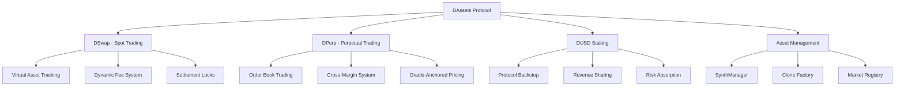
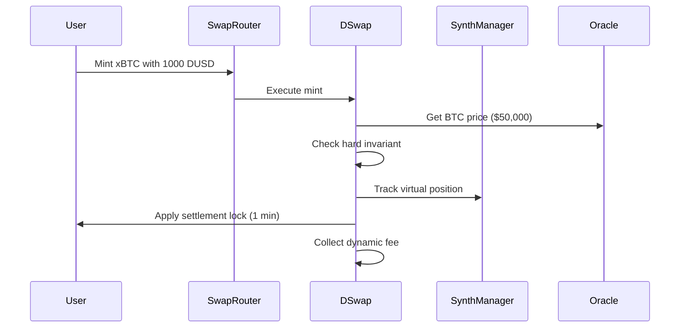
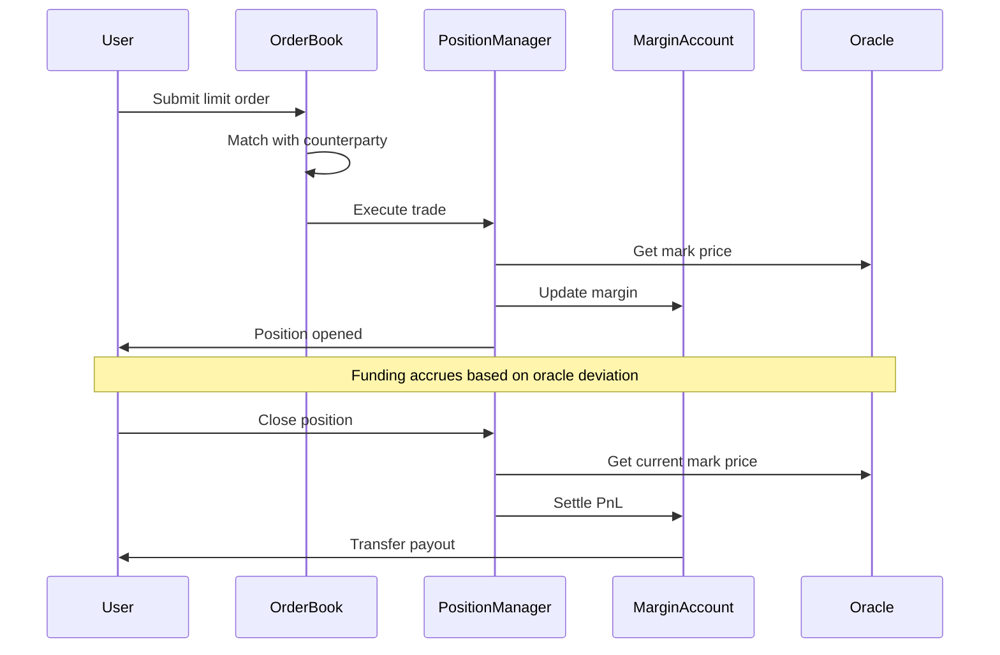
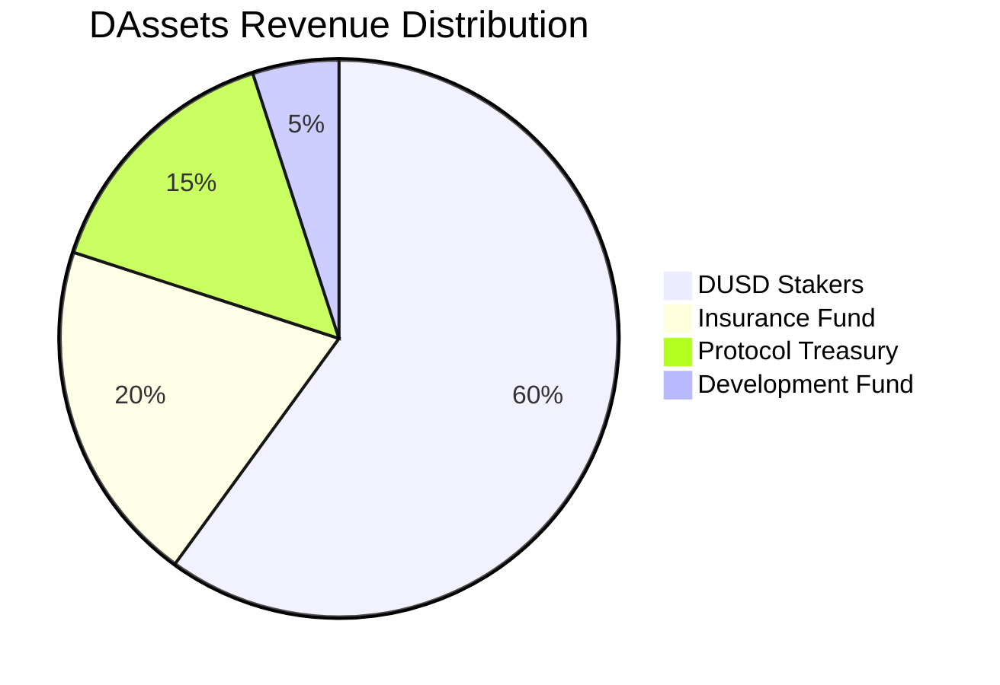

# Synthetic Assets (DAssets)

DAssets is DI Network's comprehensive synthetic asset trading system, enabling users to trade synthetic versions of real-world assets including stocks, commodities, forex, and cryptocurrencies using DUSD as collateral.

## Overview

The DAssets protocol combines spot trading and perpetual trading into a unified system, providing access to global markets 24/7 with oracle-based pricing and advanced risk management:



## Core Components

### 📊 DSwap - Spot Trading

Advanced oracle-based spot trading with dynamic risk management:

- **Virtual Assets**: No ERC20 tokens, position tracking only
- **Dynamic Fees**: Stress-based burn fees (0.3-2%)
- **Settlement Locks**: 1-minute MEV protection
- **Hard Invariants**: Mathematical solvency guarantees
- **Clone Factory**: Gas-efficient synthetic deployment


[dswap](dswap/)


### ⚡ DPerp - Perpetual Trading

CEX-style order book perpetual trading with trader-to-trader matching:

- **Order Book Model**: Central limit order book like Binance/Bybit
- **Trader-to-Trader**: Direct counterparty matching (no LP pools)
- **Oracle Pricing**: Mark price = oracle price for fair liquidations
- **Cross-Margin**: Shared margin across all positions
- **Professional Orders**: Limit, Market, Stop, Take-Profit, IOC, FOK


[dperp](dperp/)


### 💧 DUSD Staking System

Protocol backstop and revenue sharing mechanism:

- **Staking Vault**: Lock DUSD for protocol security
- **Revenue Sharing**: Earn from trading fees and liquidations
- **Risk Backstop**: Absorb bad debt after insurance fund
- **Governance Rights**: Participate in protocol decisions
- **Tiered Rewards**: Lock periods with multipliers


[liquidity](liquidity/)


## Supported Assets

### Asset Categories

| Category | Count | Examples | Oracle Source |
|----------|-------|----------|---------------|
| **Cryptocurrencies** | 15+ | xBTC, xETH, xBNB, xADA, xSOL | Chainlink + Pyth |
| **US Stocks** | 20+ | xAAPL, xTSLA, xGOOG, xAMZN, xMSFT | Chainlink |
| **Commodities** | 8+ | xGold, xSilver, xOil, xGas, xWheat | Chainlink |
| **Forex** | 10+ | xEUR, xGBP, xJPY, xCHF, xAUD | Chainlink |

### Popular Assets

<table data-view="cards">
<thead>
<tr>
<th></th>
<th></th>
<th data-hidden data-card-target data-type="content-ref"></th>
</tr>
</thead>
<tbody>
<tr>
<td><strong>xBTC - Synthetic Bitcoin</strong></td>
<td>Trade Bitcoin exposure without holding BTC</td>
<td><a href="dswap/assets.md">assets.md</a></td>
</tr>
<tr>
<td><strong>xAAPL - Synthetic Apple Stock</strong></td>
<td>24/7 Apple stock trading with leverage</td>
<td><a href="dswap/assets.md">assets.md</a></td>
</tr>
<tr>
<td><strong>xGold - Synthetic Gold</strong></td>
<td>Digital gold exposure with instant settlement</td>
<td><a href="dswap/assets.md">assets.md</a></td>
</tr>
<tr>
<td><strong>xEUR - Synthetic Euro</strong></td>
<td>Forex trading with crypto-native settlement</td>
<td><a href="dswap/assets.md">assets.md</a></td>
</tr>
</tbody>
</table>

## Key Features

### Advanced Risk Management

Multi-layer security architecture:

- **Hard Invariants**: Mathematical impossibility of protocol insolvency
- **Dynamic Fees**: Stress-based fee adjustment (0.3-2%)
- **Settlement Locks**: MEV and arbitrage protection
- **Oracle Security**: Dual oracle system with deviation limits

### Virtual Asset System

Gas-efficient synthetic asset management:

- **No ERC20 Tokens**: Virtual position tracking only
- **Clone Factory**: 97.5% gas savings on new assets
- **Instant Deployment**: Add new assets without token deployment
- **Upgradeable Logic**: Update implementation without migration

### Oracle-Anchored Trading

Trustworthy pricing across all markets:

- **Mark Price = Oracle Price**: Never order book or AMM pricing
- **Zero Slippage**: Trade at exact oracle prices
- **Real-Time Updates**: Pyth Network for high-frequency data
- **Fallback Systems**: Chainlink and manual price feeds

## Trading Mechanics

### Spot Trading Flow



### Perpetual Trading Flow



## Economic Model

### Fee Structure

| Operation | Fee | Recipient |
|-----------|-----|-----------|
| **Spot Minting** | 0.3% | DUSD Stakers |
| **Spot Burning** | 0.3-2% (Dynamic) | DUSD Stakers |
| **Spot Swapping** | 0.3% | DUSD Stakers |
| **Perpetual Trading** | Maker/Taker | DUSD Stakers |
| **Funding Rates** | Variable | Counterparty Traders |
| **Liquidations** | 0.5% + bonus | Liquidators + Insurance |

### Revenue Distribution



### DUSD Staker Economics

Stakers earn from multiple sources while providing protocol security:

1. **Trading Fees**: 0.3-2% on all spot trades
2. **Perpetual Fees**: Maker/taker fees from order book
3. **Liquidation Penalties**: Share in liquidation bonuses
4. **Protocol Revenue**: Asset listing and market maker fees
5. **Risk Premium**: Compensation for backstop role

## Risk Management

### Protocol-Level Controls

- **Hard Invariants**: Mathematical solvency guarantees
- **Dynamic Backing**: Real-time collateral monitoring
- **Settlement Locks**: MEV and arbitrage protection
- **Oracle Security**: Multi-source price validation

### Position-Level Controls

- **Cross-Margin**: Shared margin across positions
- **Oracle Liquidation**: Mark price based liquidations
- **Funding Caps**: Maximum funding rate limits
- **Market Hours**: Equity-aware risk controls

### Staker Protection

- **Insurance Fund**: First loss absorption
- **Tiered Risk**: Senior/junior staking tranches
- **Loss Waterfall**: Clear risk hierarchy
- **Governance Rights**: Parameter control

## Integration Examples

### Spot Trading

```javascript
import { DINetwork } from '@dinetwork/sdk';

const di = new DINetwork({ chainId: 1, provider: window.ethereum });

// Check dynamic fees and limits
const burnFee = await di.dswap.getBurnFeeBps();
const canMint = await di.dswap.canMint(ethers.parseEther('1000'));

// Mint synthetic Bitcoin (virtual position)
await di.swapRouter.mintSynthetic(
  keccak256('xBTC'), 
  ethers.parseEther('1000'),
  ethers.parseEther('0.024') // min output
);

// Note: 1-minute settlement lock applies
```

### Perpetual Trading

```javascript
// Submit limit order to order book
await di.orderBook.submitOrder({
  market: keccak256('BTC'),
  side: 'BUY',
  size: ethers.parseEther('10000'),
  price: ethers.parseEther('50000'),
  orderType: 'LIMIT'
});

// Close position at market
await di.positionManager.closePosition(
  keccak256('BTC'),
  ethers.parseEther('50000') // acceptable price
);
```

### DUSD Staking

```javascript
// Stake DUSD for protocol rewards
await di.dusdStaking.stake(
  ethers.parseEther('10000'),
  365 * 24 * 60 * 60 // 1 year lock
);

// Claim rewards
await di.dusdStaking.claimRewards();

// Unstake after lock period
await di.dusdStaking.unstake(stakeId);
```

## Monitoring & Analytics

### Key Metrics

- **Total Trading Volume**: Daily/weekly trading across all assets
- **Open Interest**: Total perpetual positions by asset
- **Liquidity Utilization**: Percentage of liquidity pool in use
- **Funding Rates**: Current funding rates for each asset
- **Asset Performance**: Price performance of synthetic assets

### Real-Time Data

- **Live Prices**: Real-time oracle prices for all assets
- **Position Health**: Monitor liquidation risks
- **Pool Status**: Liquidity pool utilization and rewards
- **Market Activity**: Recent trades and position changes

## Roadmap

### Current Features ✅
- [x] Virtual asset system with clone factory
- [x] Dynamic risk management
- [x] Order book perpetual trading
- [x] DUSD staking backstop
- [x] Oracle-anchored pricing

### In Development 🔄
- [ ] Market maker incentives
- [ ] Advanced order types (IOC, FOK)
- [ ] Isolated margin mode
- [ ] Mobile trading interface

### Future Plans 🔜
- [ ] Cross-chain synthetic assets
- [ ] Institutional trading features
- [ ] Automated market making
- [ ] Regulatory compliance tools

---


[registry.md](registry.md)


The DAssets protocol provides comprehensive access to global markets through synthetic assets, combining the benefits of traditional finance with the innovation and accessibility of decentralized finance.