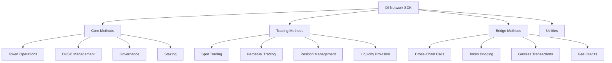

# SDK Reference

The DI Network SDK provides a comprehensive JavaScript/TypeScript interface for integrating with all protocol features.

## Overview

The SDK is designed for ease of use while providing access to all protocol functionality:



## Installation & Setup

### Installation
Install the SDK via npm, yarn, or pnpm.


[installation.md](installation.md)


### Core Methods
Basic SDK functionality and token operations.


[core.md](core.md)


### Trading Methods
Spot and perpetual trading functionality.


[trading.md](trading.md)


### Bridge Methods
Cross-chain operations and gasless transactions.


[bridge.md](bridge.md)


## Quick Start

### Basic Setup
```javascript
import { DINetwork } from '@dinetwork/sdk';

const di = new DINetwork({
  chainId: 1, // Ethereum mainnet
  provider: window.ethereum,
  apiKey: 'your-api-key' // Optional
});

// Check connection
const isConnected = await di.isConnected();
console.log('Connected:', isConnected);
```

### Configuration Options
```javascript
const config = {
  // Required
  chainId: 1,
  provider: window.ethereum,
  
  // Optional
  apiKey: 'your-api-key',
  apiUrl: 'https://api.dinetwork.xyz',
  gasPrice: 'fast', // 'slow', 'standard', 'fast', or custom
  gasLimit: 500000,
  slippage: 0.5, // 0.5%
  
  // Contract addresses (auto-detected if not provided)
  contracts: {
    diToken: '0x...',
    dusdToken: '0x...',
    dswap: '0x...',
    dperp: '0x...'
  }
};

const di = new DINetwork(config);
```

## Core Features

### Token Operations
```javascript
// Get balances
const diBalance = await di.tokens.getDIBalance(userAddress);
const dusdBalance = await di.tokens.getDUSDBalance(userAddress);

// Approve tokens
await di.tokens.approve('DI', 'DUSD_PROVIDER', amount);

// Transfer tokens
await di.tokens.transfer('DI', recipientAddress, amount);
```

### DUSD Operations
```javascript
// Mint DUSD
await di.dusd.mint({
  collateralToken: 'DI',
  collateralAmount: ethers.parseEther('1000'),
  dusdAmount: ethers.parseEther('750')
});

// Repay DUSD
await di.dusd.repay(ethers.parseEther('750'));

// Check position
const position = await di.dusd.getPosition(userAddress);
```

### Trading Operations
```javascript
// Spot trading
await di.dswap.mintSynthetic('xBTC', ethers.parseEther('1000'));
await di.dswap.swapSynthetic('xBTC', 'xETH', ethers.parseEther('0.5'));

// Perpetual trading
await di.dperp.openPosition({
  asset: 'BTC',
  collateral: ethers.parseEther('1000'),
  size: ethers.parseEther('10000'),
  isLong: true
});
```

### Cross-Chain Operations
```javascript
// Bridge tokens
await di.bridge.bridgeToken({
  token: 'DUSD',
  amount: ethers.parseEther('1000'),
  destinationChainId: 56,
  recipient: userAddress
});

// Gasless transaction
await di.bridge.executeGaslessTransaction({
  to: targetContract,
  data: encodedCall,
  gasToken: 'DUSD'
});
```

## Error Handling

### SDK Errors
```javascript
import { DINetworkError, TransactionError } from '@dinetwork/sdk';

try {
  await di.dusd.mint(params);
} catch (error) {
  if (error instanceof DINetworkError) {
    console.error('DI Network Error:', error.message);
  } else if (error instanceof TransactionError) {
    console.error('Transaction failed:', error.reason);
  } else {
    console.error('Unexpected error:', error);
  }
}
```

### Common Error Types
- **InsufficientBalance**: Not enough tokens
- **InsufficientAllowance**: Need to approve tokens
- **SlippageExceeded**: Price moved beyond tolerance
- **PositionNotFound**: Position doesn't exist
- **LiquidationRisk**: Position at risk of liquidation

## Event Monitoring

### Subscribe to Events
```javascript
// Position events
di.dperp.on('PositionOpened', (event) => {
  console.log('Position opened:', event);
});

di.dperp.on('PositionClosed', (event) => {
  console.log('Position closed:', event);
});

// Bridge events
di.bridge.on('CrossChainCallInitiated', (event) => {
  console.log('Cross-chain call initiated:', event);
});
```

### Event Filtering
```javascript
// Filter events by user
const userEvents = await di.dperp.getEvents({
  eventName: 'PositionOpened',
  filter: { user: userAddress },
  fromBlock: 'latest',
  toBlock: 'latest'
});
```

## Utilities

### Price Feeds
```javascript
// Get current prices
const btcPrice = await di.oracle.getPrice('BTC');
const ethPrice = await di.oracle.getPrice('ETH');

// Get historical prices
const historicalPrices = await di.oracle.getHistoricalPrices('BTC', {
  from: Date.now() - 86400000, // 24 hours ago
  to: Date.now(),
  interval: '1h'
});
```

### Gas Estimation
```javascript
// Estimate gas for operations
const gasEstimate = await di.estimateGas.mintSynthetic('xBTC', amount);
const gasCost = gasEstimate * gasPrice;

console.log(`Estimated gas: ${gasEstimate}`);
console.log(`Estimated cost: ${ethers.formatEther(gasCost)} ETH`);
```

### Batch Operations
```javascript
// Batch multiple operations
const batch = di.batch()
  .approve('DI', 'DUSD_PROVIDER', amount)
  .dusd.mint(params)
  .dswap.mintSynthetic('xBTC', amount);

const tx = await batch.execute();
await tx.wait();
```

## TypeScript Support

### Type Definitions
```typescript
import { DINetwork, Position, SyntheticAsset } from '@dinetwork/sdk';

interface UserPortfolio {
  diBalance: bigint;
  dusdBalance: bigint;
  positions: Position[];
  synthBalances: Record<string, bigint>;
}

const di = new DINetwork(config);
const portfolio: UserPortfolio = await di.getPortfolio(userAddress);
```

### Generic Types
```typescript
// Typed contract interactions
const position = await di.dperp.getPosition<Position>(userAddress, 'BTC', true);
const assets = await di.dswap.getSupportedAssets<SyntheticAsset[]>();
```

## Testing

### Mock Provider
```javascript
import { MockProvider } from '@dinetwork/sdk/testing';

const mockProvider = new MockProvider();
const di = new DINetwork({
  chainId: 31337,
  provider: mockProvider
});

// Mock responses
mockProvider.mockCall('getBalance', ethers.parseEther('1000'));
```

### Test Utilities
```javascript
import { testUtils } from '@dinetwork/sdk/testing';

// Create test position
const testPosition = testUtils.createPosition({
  asset: 'BTC',
  size: ethers.parseEther('10000'),
  isLong: true
});

// Mock price feeds
testUtils.mockPrice('BTC', ethers.parseEther('50000'));
```