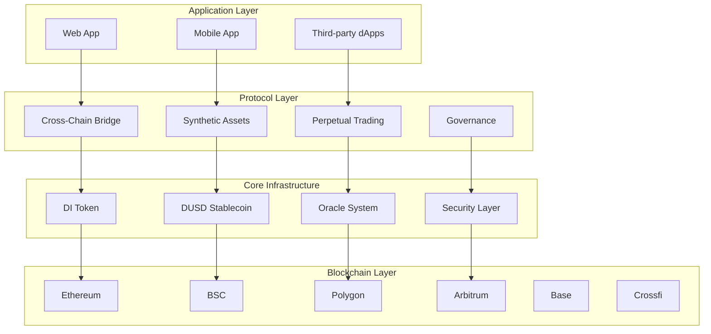

# Architecture Overview

DI Network's architecture is designed as a modular, multi-chain protocol that provides seamless interoperability and advanced DeFi capabilities across multiple blockchain networks.

## System Architecture

## Design Principles

### 1. Multi-Chain Native
- **Unified State**: Consistent protocol state across all chains
- **Cross-Chain Liquidity**: Shared liquidity pools
- **Seamless UX**: Single interface for all networks

### 2. Modular Design
- **Independent Components**: Each module can be upgraded separately
- **Composable**: Modules work together seamlessly
- **Extensible**: Easy to add new features and networks

### 3. Security First
- **Defense in Depth**: Multiple security layers
- **Formal Verification**: Critical components mathematically proven
- **Continuous Monitoring**: Real-time security monitoring

## Core Components

### Cross-Chain Infrastructure
Enables seamless multi-chain operations with gasless transactions and unified liquidity.

### Synthetic Assets System
Provides access to global markets through oracle-based synthetic assets with spot and perpetual trading.

### Governance Framework
Decentralized governance system allowing community control over all protocol parameters.

## Technical Stack

| Layer | Technology | Purpose |
|-------|------------|---------|
| **Smart Contracts** | Solidity 0.8.24+ | Core protocol logic |
| **Oracles** | Chainlink + Pyth | Price feeds |
| **Frontend** | React + TypeScript | User interface |
| **Backend** | Node.js + GraphQL | API services |
| **Database** | PostgreSQL | Off-chain data |
| **Monitoring** | Grafana + Prometheus | System monitoring |