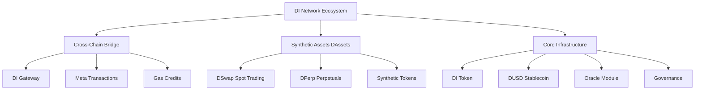
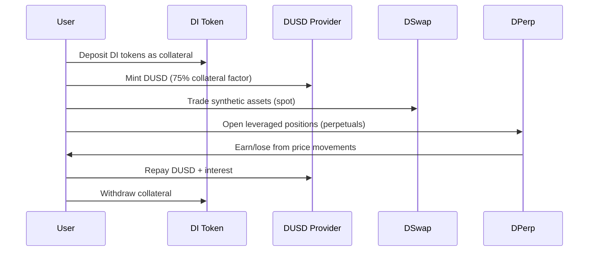
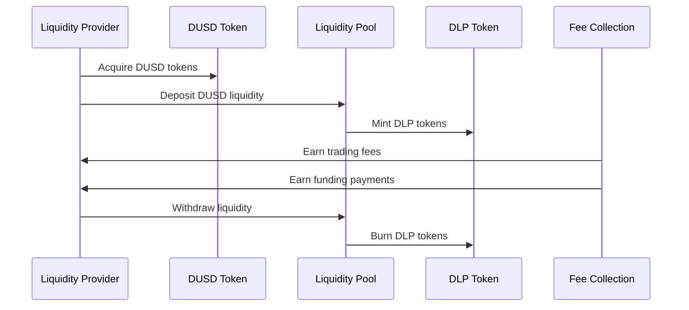
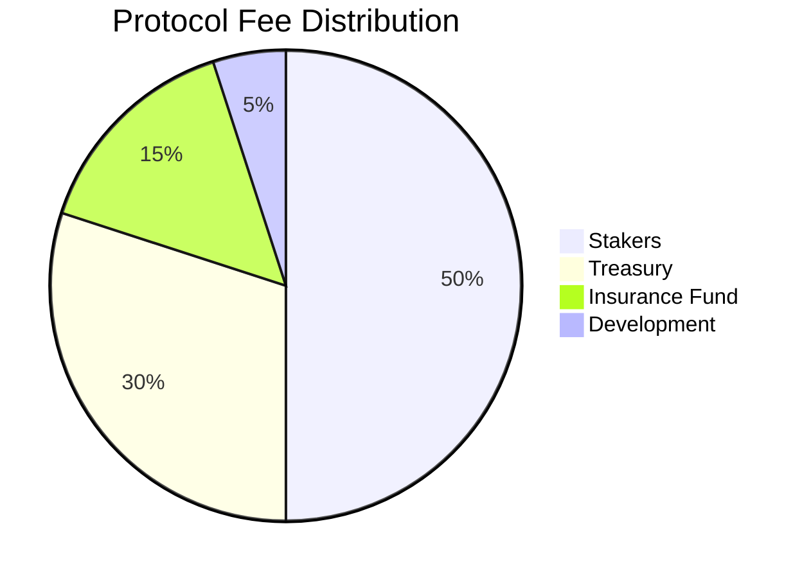

# Protocol Overview

DI Network is a comprehensive decentralized finance ecosystem designed for the multi-chain future. It combines cross-chain interoperability, synthetic asset trading, and advanced financial primitives into a unified protocol.

## Core Architecture

## Protocol Components

### 🌉 Cross-Chain Infrastructure

**Purpose**: Enable seamless asset transfers and interactions across multiple blockchain networks.

**Key Features**:
- **Multi-Chain Support**: Ethereum, BSC, Polygon, Arbitrum, Base, Crossfi
- **Gasless Transactions**: Pay fees in DUSD across all networks
- **Secure Bridging**: Decentralized relayer network for message validation
- **Unified Experience**: Single interface for all supported chains


[CrossChain-Subsystem.md](../subsystems/CrossChain-Subsystem.md)


### 📈 Synthetic Assets (DAssets)

**Purpose**: Trade synthetic versions of real-world assets using DUSD as collateral.

**Components**:
- **DSwap**: Spot trading of synthetic assets with oracle pricing
- **DPerp**: GMX-style perpetual trading with up to 50x leverage
- **Asset Coverage**: Stocks, commodities, forex, and cryptocurrencies

**Supported Assets**:
- **Stocks**: xAAPL, xTSLA, xGOOG, xAMZN, xMSFT
- **Commodities**: xGold, xSilver, xOil, xGas
- **Crypto**: xBTC, xETH, xBNB, xADA, xSOL
- **Forex**: xEUR, xGBP, xJPY, xCHF


[DAssets-Subsystem.md](../subsystems/DAssets-Subsystem.md)


### 🪙 Core Infrastructure

**Purpose**: Provide the foundational tokens and systems that power the entire ecosystem.

**Components**:
- **DI Token**: Native governance and utility token
- **DUSD**: Over-collateralized algorithmic stablecoin
- **Oracle Module**: Dual oracle system (Chainlink + Pyth)
- **Governance**: DAO-controlled parameter management


[Tokens-Subsystem.md](../subsystems/Tokens-Subsystem.md)


## Key Innovations

### 1. Unified Multi-Chain Experience

Unlike other protocols that deploy separately on each chain, DI Network provides a truly unified experience:

- **Shared Liquidity**: Liquidity pools span across all supported chains
- **Cross-Chain Positions**: Open positions on one chain, close on another
- **Unified Gas Payment**: Use DUSD for gas fees on any supported network

### 2. Oracle-Based Synthetic Trading

Traditional AMMs suffer from slippage and impermanent loss. DI Network uses oracle pricing for:

- **Zero Slippage**: Trade at exact oracle prices
- **24/7 Markets**: Access global markets anytime
- **Infinite Liquidity**: No liquidity constraints for trading

### 3. GMX-Style Perpetual Trading

Advanced perpetual trading system with:

- **LP as Counterparty**: Liquidity providers act as the house
- **Isolated Positions**: Each position is independent for risk management
- **Dynamic Funding**: Utilization-based funding rates
- **Advanced Risk Management**: Automated liquidations and position limits

### 4. Gasless Transaction System

Revolutionary gas payment system:

- **DUSD Gas Credits**: Deposit DUSD to pay for gas on any chain
- **Meta-Transactions**: Sign transactions without holding native tokens
- **Batch Operations**: Execute multiple operations in single transaction

## Protocol Flow

### For Traders

### For Liquidity Providers

## Economic Model

### Value Accrual

The protocol creates value through multiple mechanisms:

1. **Trading Fees**: 0.1-0.3% on all synthetic asset trades
2. **Interest Payments**: 5% APR on borrowed DUSD
3. **Funding Rates**: Perpetual trading funding payments
4. **Bridge Fees**: Cross-chain transaction fees
5. **Liquidation Penalties**: 5% bonus on liquidated positions

### Fee Distribution

### Token Utility

**DI Token**:
- Primary collateral for DUSD minting
- Governance voting rights
- Staking rewards (8-20% APY)
- Fee distribution sharing

**DUSD Token**:
- Base currency for all trading
- Cross-chain gas payment
- Liquidity provision
- Bridge transfers

## Risk Management

### Protocol-Level Risks

1. **Smart Contract Risk**: Comprehensive audits and bug bounty program
2. **Oracle Risk**: Dual oracle system with deviation limits
3. **Economic Risk**: Dynamic parameters and circuit breakers
4. **Governance Risk**: Timelock delays and multi-sig controls

### User-Level Risks

1. **Liquidation Risk**: Monitor collateral ratios and position health
2. **Market Risk**: Understand volatility and correlation risks
3. **Impermanent Loss**: LP positions subject to trader profits/losses
4. **Regulatory Risk**: Compliance with local regulations


[security.md](../resources/security.md)


## Roadmap

### ✅ Phase 1: Foundation (Q1-Q2 2024)
- [x] Core protocol launch
- [x] Cross-chain bridge deployment
- [x] Synthetic asset trading
- [x] Perpetual trading
- [x] Multi-chain expansion

### 🔄 Phase 2: Enhancement (Q3 2024)
- [ ] Options trading protocol
- [ ] Real-world asset integration
- [ ] Advanced order types
- [ ] Institutional features

### 🔜 Phase 3: Scale (Q4 2024+)
- [ ] Layer 2 scaling solutions
- [ ] Cross-chain governance
- [ ] Advanced derivatives
- [ ] Regulatory compliance tools

## Getting Started

Ready to explore DI Network? Choose your path:


[quick-start.md](quick-start.md)



[getting-started.md](../user-guides/getting-started.md)



[setup.md](../developers/setup.md)
