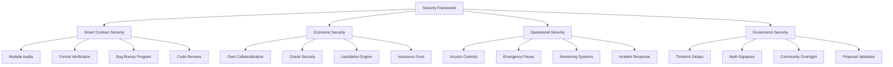

# Security Overview

DI Network implements a comprehensive security framework with multiple layers of protection, regular audits, and continuous monitoring to ensure protocol and user safety.

## Security Framework

## Security Layers

### 1. Smart Contract Security
Comprehensive protection at the code level.


[contracts.md](contracts.md)


### 2. Economic Security
Financial mechanisms protecting protocol solvency.


[economics.md](economics.md)


### 3. Audit Reports
Independent security assessments and findings.


[audits.md](audits.md)


### 4. Bug Bounty Program
Community-driven security testing and rewards.


[bug-bounty.md](bug-bounty.md)


### 5. Best Practices
Security guidelines for users and developers.


[best-practices.md](best-practices.md)


## Key Security Features

### Multi-Layered Defense
- **Smart Contract Audits**: Multiple independent audits
- **Formal Verification**: Mathematical proofs for critical functions
- **Economic Incentives**: Aligned incentives prevent attacks
- **Operational Controls**: Emergency pause and circuit breakers

### Oracle Security
- **Dual Oracle System**: Chainlink + Pyth redundancy
- **Price Validation**: Cross-reference and deviation limits
- **Staleness Protection**: Reject outdated price feeds
- **Circuit Breakers**: Pause on extreme price movements

### Access Control
- **Role-Based Permissions**: Granular access controls
- **Multi-Signature**: Critical operations require multiple signatures
- **Timelock Delays**: 48-hour delay on parameter changes
- **Emergency Procedures**: Rapid response capabilities

## Security Metrics

### Audit Coverage
- **Lines of Code Audited**: 15,000+
- **Security Firms**: 3 independent auditors
- **Audit Rounds**: 5 comprehensive audits
- **Critical Issues**: 0 unresolved critical findings

### Bug Bounty Statistics
- **Total Rewards**: $500,000 allocated
- **Submissions**: 150+ reports reviewed
- **Valid Bugs**: 25 confirmed issues
- **Average Payout**: $5,000 per valid bug

### Incident Response
- **Response Time**: <2 hours for critical issues
- **Resolution Time**: <24 hours average
- **Uptime**: 99.9% protocol availability
- **Zero Exploits**: No successful attacks to date

## Risk Assessment

### High-Risk Areas
1. **Oracle Manipulation**: Price feed attacks
2. **Flash Loan Attacks**: Temporary liquidity manipulation
3. **Governance Attacks**: Malicious proposal execution
4. **Smart Contract Bugs**: Code vulnerabilities

### Mitigation Strategies
1. **Dual Oracle System**: Prevents single point of failure
2. **Cooldown Periods**: Prevent flash loan attacks
3. **Timelock Delays**: Allow community response time
4. **Comprehensive Testing**: Extensive test coverage

## Monitoring Systems

### Real-Time Monitoring
- **Position Health**: Continuous liquidation risk monitoring
- **Oracle Prices**: Price feed validation and alerts
- **System Utilization**: Pool utilization and limits
- **Governance Activity**: Proposal and voting monitoring

### Alert Systems
- **Critical Alerts**: Immediate notification for critical issues
- **Performance Alerts**: System performance degradation
- **Security Alerts**: Suspicious activity detection
- **Governance Alerts**: Important governance events

## Emergency Procedures

### Emergency Pause
- **Trigger Conditions**: Critical vulnerabilities or attacks
- **Authority**: 5-of-9 multi-signature wallet
- **Scope**: Can pause individual modules or entire protocol
- **Recovery**: Community governance required for unpausing

### Incident Response Plan
1. **Detection**: Automated monitoring or community reports
2. **Assessment**: Rapid evaluation of threat severity
3. **Response**: Immediate protective measures
4. **Communication**: Transparent community updates
5. **Resolution**: Fix implementation and testing
6. **Post-Mortem**: Analysis and prevention improvements

## User Security

### Wallet Security
- **Hardware Wallets**: Recommended for large amounts
- **Seed Phrase Protection**: Never share recovery phrases
- **Regular Updates**: Keep wallet software updated
- **Phishing Protection**: Verify website URLs

### Transaction Security
- **Contract Verification**: Always verify contract addresses
- **Slippage Settings**: Set appropriate slippage tolerance
- **Gas Limits**: Use recommended gas limits
- **Transaction Review**: Double-check all parameters

### Best Practices
- **Start Small**: Test with small amounts first
- **Regular Monitoring**: Check positions frequently
- **Risk Management**: Never invest more than you can lose
- **Stay Informed**: Follow official channels for updates

## Security Roadmap

### Current Initiatives
- **Continuous Auditing**: Ongoing security assessments
- **Bug Bounty Expansion**: Increased rewards and scope
- **Formal Verification**: Mathematical proofs for more functions
- **Monitoring Enhancement**: Improved detection systems

### Future Plans
- **Insurance Integration**: Third-party insurance coverage
- **Security Council**: Dedicated security governance body
- **Automated Response**: AI-powered threat detection
- **Cross-Chain Security**: Enhanced multi-chain protection

## Reporting Security Issues

### Responsible Disclosure
1. **Email**: security@dinetwork.xyz
2. **Encrypted Communication**: PGP key available
3. **Bug Bounty Platform**: HackerOne program
4. **Response Time**: <24 hours acknowledgment

### What to Include
- **Detailed Description**: Clear explanation of the issue
- **Reproduction Steps**: How to reproduce the vulnerability
- **Impact Assessment**: Potential consequences
- **Suggested Fix**: Proposed solution if available

---

Security is our top priority. We continuously work to maintain the highest security standards and appreciate the community's help in keeping DI Network safe for all users.