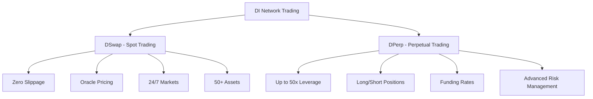

# Trading Guide

Learn how to trade synthetic assets and perpetual contracts on DI Network, from basic spot trading to advanced leveraged strategies.

## Trading Overview

DI Network offers two main trading systems:



## Getting Started

### Prerequisites
- **DUSD Balance**: Base currency for all trading
- **Connected Wallet**: MetaMask or compatible wallet
- **Network Selection**: Choose your preferred network
- **Risk Understanding**: Know the risks before trading

### First Steps
1. **Acquire DUSD**: Mint DUSD using DI or other collateral
2. **Choose Trading Type**: Spot or perpetual trading
3. **Select Asset**: Pick from 50+ available assets
4. **Execute Trade**: Follow the trading guides below

## Trading Types

### 🔄 Spot Trading
Trade synthetic assets with zero slippage using oracle pricing.


[spot.md](spot.md)


### ⚡ Perpetual Trading
Trade with leverage up to 50x using advanced position management.


[perpetuals.md](perpetuals.md)


### 🛡️ Risk Management
Essential risk management strategies for all traders.


[risk.md](risk.md)


## Quick Start Examples

### Spot Trading Example
```javascript
// Mint synthetic Bitcoin
await di.dswap.mintSynthetic('xBTC', ethers.parseEther('1000'));

// Swap to synthetic Ethereum
await di.dswap.swapSynthetic('xBTC', 'xETH', ethers.parseEther('0.5'));

// Burn back to DUSD
await di.dswap.burnSynthetic('xETH', ethers.parseEther('10'));
```

### Perpetual Trading Example
```javascript
// Open 10x long BTC position
await di.dperp.openPosition({
  asset: 'BTC',
  collateral: ethers.parseEther('1000'),
  size: ethers.parseEther('10000'),
  isLong: true,
  leverage: 10
});

// Close position
await di.dperp.closePosition({
  asset: 'BTC',
  sizeDelta: ethers.parseEther('10000'),
  isLong: true
});
```

## Available Assets

### Cryptocurrencies
- **Major**: BTC, ETH, BNB, ADA, SOL
- **DeFi**: UNI, AAVE, COMP, SUSHI
- **Layer 1**: DOT, AVAX, ATOM, NEAR

### Traditional Assets
- **Stocks**: AAPL, TSLA, GOOGL, AMZN, MSFT
- **Commodities**: Gold, Silver, Oil, Gas
- **Forex**: EUR, GBP, JPY, CHF, AUD

## Trading Features

### Zero Slippage (Spot)
- Trade at exact oracle prices
- No price impact regardless of size
- Fair execution for all traders

### High Leverage (Perpetuals)
- Up to 50x leverage on major assets
- Isolated margin positions
- Advanced risk controls

### 24/7 Trading
- Trade traditional assets anytime
- No market hours restrictions
- Weekend and holiday trading

### Cross-Chain Support
- Trade on any supported network
- Unified liquidity across chains
- Cross-chain position management

## Fee Structure

| Trading Type | Operation | Fee |
|--------------|-----------|-----|
| **Spot** | Mint/Burn | 0.1% |
| **Spot** | Swap | 0.3% |
| **Perpetual** | Open/Close | 0.1% |
| **Perpetual** | Funding | Variable |

## Risk Warnings


**High Risk Trading**

- Perpetual trading involves high risk of loss
- Leverage amplifies both gains and losses
- Only trade with funds you can afford to lose
- Always use proper risk management


### Common Risks
- **Market Risk**: Price volatility can cause losses
- **Liquidation Risk**: Leveraged positions can be liquidated
- **Funding Risk**: Funding rates can be costly over time
- **Smart Contract Risk**: Protocol risks exist

### Risk Mitigation
- **Start Small**: Begin with small position sizes
- **Use Stop Losses**: Set automatic exit points
- **Diversify**: Don't put all funds in one position
- **Monitor Positions**: Check positions regularly
- **Understand Leverage**: Know how leverage affects risk

## Trading Strategies

### Conservative Strategy
- **Spot Trading Only**: No leverage risk
- **Blue Chip Assets**: Trade major cryptocurrencies
- **Small Positions**: 1-5% of portfolio per trade
- **Long-Term Holds**: Hold positions for weeks/months

### Moderate Strategy
- **Low Leverage**: 2-5x maximum leverage
- **Mixed Assets**: Crypto and traditional assets
- **Medium Positions**: 5-10% of portfolio per trade
- **Swing Trading**: Hold positions for days/weeks

### Aggressive Strategy
- **High Leverage**: 10-50x leverage
- **All Asset Classes**: Full range of available assets
- **Large Positions**: 10-25% of portfolio per trade
- **Day Trading**: Intraday position management

## Getting Help

### Resources
- **Documentation**: Complete trading guides
- **Discord**: Community support and discussion
- **Tutorials**: Video guides and walkthroughs
- **FAQ**: Common questions and answers

### Support Channels
- **Discord**: Real-time community help
- **Telegram**: Official announcements
- **Twitter**: Updates and tips
- **GitHub**: Technical documentation

---

Ready to start trading? Choose your preferred trading type and follow the detailed guides above.